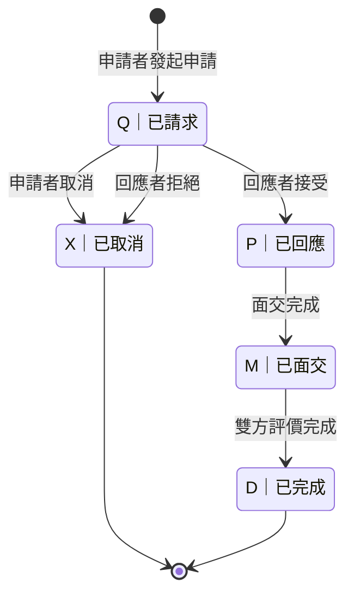

# Exbooks 共享書籍 — 需求擷取

## 1. 概念發想

近幾年共享經濟（Sharing Economy）火紅，已廣泛應用在各個領域，包含環保、公益、或商業等應用領域。

擬規劃推行一套公益性質的「共享書籍」計劃，鼓勵民眾加入本社群平臺，並拿出自有的藏書與其他人交換閱讀。

當然，搭配並設計一套雲端應用系統做為訊息交換平臺是絕對必要的。但在此之前，必要先提出整體運作模式，以確保所訂定的業務流程及規則能合理且平順的運作。

---

## 2. 書籍共享規則

1. 書籍由平臺用戶自行保管，而非集中於某一實體圖書館中。
2. 平臺用戶可將自己願意分享的書籍上架至系統平臺，並且定義該冊書籍的「流通性」為：**「開放傳遞」** 或 **「閱畢即還」**。
3. 針對「開放傳遞」的書籍，貢獻者有權請求持有者歸還該書籍，持有者不得拒絕，但若有衍生的運費，原則上由書籍貢獻者負擔。
4. 借入書籍者必須依照借出書籍者所指定或相互約定的時間地點取書。
5. 系統尚無金流與物流功能規劃，書籍的借出與借入一律採 **「面交」** 方式認定。
6. 系統將自動記錄每位用戶的書籍共享與借閱數據公開，供社群成員查閱，以鼓勵用戶積極參與共享，並建立評價制度做為信用參考依據。
7. 系統提供 **PWA (Progressive Web App)** 支援，優化手機端操作體驗，包含離線存取能力與桌面捷徑安裝。
8. 某些書籍為套書，適合全套借閱，貢獻者可事先將全套書籍綁定為套書，系統將限制以套書方式借出，以免日後可能過於分散，貢獻者難以追回。
9. 書籍若損毀、遺失、或尋獲時，由最後一位持有者向貢獻者申請註銷或復原。衍生的協商或賠償問題，本系統不介入處理。
10. 年滿 **18 歲** 以上之成年人，方能註冊使用本系統及服務。

---

## 3. 平臺運作模式

### 3.1 使用者角色與權限

| 角色                  | 說明                                                                                                               |
| --------------------- | ------------------------------------------------------------------------------------------------------------------ |
| **一般用戶 (Member)** | 採用第三方 Google Account 認證授權系統來加入本平臺。註冊後可上架書籍、申請借閱、評價交易對象、拍攝書籍現況照片等。 |
| **貢獻者 (Owner)**    | 分享自有的書籍，並上架至系統平臺供其他用戶借閱。                                                                   |
| **持有者 (Keeper)**   | 該書籍正在手中，但本人可能非書籍貢獻者。                                                                           |
| **讀者 (Reader)**     | 想要借閱書籍的用戶。                                                                                               |
| **管理員 (SysAdmin)** | 負責維護平臺運作、制定相關使用規則、審核異常交易等。                                                               |

> **注意**：Owner、Keeper、Reader 並非固定角色，而是相對於特定書籍的 **情境角色**。同一用戶可同時為某些書的 Owner、另一些書的 Keeper、也可以是其他書的 Reader。

### 3.2 使用者註冊

- 用戶 Email 帳號驗證
- 編輯「用戶資料」：
  - 用戶暱稱
  - 預設書籍可傳遞性
  - 預設取書地點
  - 預設可約取書的空檔時間（以 Weekday 來定義）

> **實作現況：**「預設取書地點」和「可約時間」目前**未自動填入**書籍/交易建立表單中。

### 3.3 貢獻書籍與上架 (Provide)

貢獻者將自有書籍上架至平臺，供其他用戶瀏覽與借閱。

1. **新增「官方書目」資料**：含書名、作者、ISBN、出版社等欄位
   - 以 **ISBN 為 KEY**，若該書籍資料已存在，則免新增，直接選取即可
2. **新增「分享書籍」資料**：
   - 書況描述
   - 書況照片（上傳至少一張書籍現況照片）
   - 可傳遞性（開放傳遞 / 閱畢即還）
   - 建議借閱週數
   - 建議可延長借閱週數
3. 書籍上架後，初始狀態為 `S`（暫不開放），由 Owner 手動開放為 `T`（可移轉）後，其他用戶方可申請借閱。
4. Owner 可隨時將書籍狀態切換為 `S`（暫不開放），暫停接受新的借閱申請。

### 3.4 查詢書籍 (SearchBook)

所有用戶（含非會員）皆可瀏覽與搜尋平臺上的書籍。

- 可依 **書名、作者、ISBN、出版社** 等關鍵字搜尋
- 可依 **書籍狀態**（可移轉 / 借閱中 等）篩選
- 可依 **流通性**（開放傳遞 / 閱畢即還）篩選
- 搜尋結果顯示書籍基本資訊、書況照片、目前狀態、持有者等

### 3.5 願望書車 (WishList)

讀者可將感興趣但目前無法借閱的書籍加入「願望書車」。

- 以「官方書目」為單位收藏（而非特定某一冊分享書籍）
- 同一本書不可重複加入
- 當願望書車中的書籍有新的可借閱冊數上架時（狀態變為 `T`），系統自動發送通知信提醒讀者

### 3.6 借閱申請與媒合

#### 申請借閱

- 用戶可在系統內瀏覽書籍，並對狀態為 `T`（可移轉）的書籍發起借閱申請
- 同一本書可能同時有多位讀者申請借閱

#### 選擇接受申請者 (SelectApplicant)

- 當同一冊書籍有 **多位讀者** 同時申請時，持有者（Keeper）或貢獻者（Owner）可從申請列表中 **選擇一位** 接受
- 被選中的申請進入已回應狀態（`P`），其餘申請自動標記為已取消（`X`）
- 選擇時可參考申請者的信用評價

#### 拒絕交易申請 (DeclineDeal)

- 持有者（Keeper）或貢獻者（Owner）可拒絕任一筆交易申請
- 拒絕後該交易狀態變為 `X`（已取消），書籍狀態不變
- 系統發送通知信告知申請者

#### 取消申請 (CancelRequest)

- **申請者** 可在交易狀態為 `Q`（已請求）時，主動取消自己發出的申請
- 適用範圍：
  - Reader 取消已發出的 **借用交易 (Borrow)** 申請
  - Reader 取消已發出的 **傳遞交易 (Import)** 申請
  - Reader 取消已發出的 **返還交易 (Return)** 申請
  - Owner 取消已發出的 **回歸交易 (Withdraw)** 申請
  - Keeper 取消已發出的 **例外處理 (Declare)** 申請
  - Reader 取消已發出的 **延長借閱 (ExtendLoan)** 申請
- 取消後交易狀態變為 `X`（已取消），書籍狀態恢復為取消前的狀態
- 系統發送通知信告知回應者

### 3.7 交易留言與協商 (Negotiate)

交易雙方（申請者與回應者）可在交易進行中透過系統留言功能進行協商。

- 交易狀態為 `Q`（已請求）、`P`（已回應）時均可留言
- 留言內容包括但不限於：
  - 約定面交時間與地點
  - 書況確認與溝通
  - 其他相關事宜
- 留言紀錄永久保存，供雙方隨時查閱

### 3.8 面交取書

- 借入者需依約定時間地點取書，並在面交時確認書況
- 面交成功後，雙方在系統內確認面交完成，交易狀態變為 `M`（已面交）
- 面交完成時系統自動處理：
  - 變更書籍持有人（`SharedBook.keeper`）
  - 變更書籍狀態（依交易類別而異）

### 3.9 書況確認與照片上傳 (PhotoUpload)

- 借入者須於取書成功後 **拍攝書籍現況照片並上傳** 至系統
- 照片紀錄關聯至該筆交易，以便後續借閱者了解書籍狀況
- 每冊書籍的照片歷史累積保存，形成書況追蹤時間線

### 3.10 交易評價 (RateUser)

- 面交完成後（交易狀態為 `M`），雙方可互相評價
- 評價維度：
  - **誠信** — 是否守約、交易是否順利
  - **準時** — 是否依約定時間赴約
  - **書況描述準確度** — 書籍實際狀況與描述是否相符
- 每項評分範圍：**1 ~ 5 分**
- 可附加文字評語
- 雙方均完成評價後，交易狀態自動變為 `D`（已完成）
- 評價結果公開於社群供參考

### 3.11 申請延長借閱 (ExtendLoan)

借閱期間，讀者（Reader）可向持有者或貢獻者申請延長借閱。

#### 申請規則

- 僅限借閱狀態為 `O`（借閱中）的書籍可申請延長
- 申請延長的天數由貢獻者在上架時設定（建議可延長借閱週數），系統規定：**最少 7 天、最多 30 天**
- 同一筆交易可 **多次申請延長**，但每次需重新審核
- Reader 可在延長申請狀態為 `PENDING`（待審核）時取消申請

#### 審核流程

- **「閱畢即還」書籍**：由 Owner（貢獻者）審核
- **「開放傳遞」書籍**：由 Keeper（持有者，即前一手借出者）審核
- 審核結果：
  - **核准 (APPROVED)**：系統自動延長交易的到期日（`Deal.due_date`），並發送通知信給申請者
  - **拒絕 (REJECTED)**：發送通知信給申請者，借閱到期日不變

### 3.12 書籍歸還與循環

- 各書籍的可借閱天數由貢獻者決定，但需依系統規定：**最少 15 天、最多 90 天、預設 30 天**
- 借閱期限內，借入者應準時歸還書籍
- 書籍持有者確認歸還後，可再次上架書籍，供其他用戶借閱

### 3.13 系統自動處理

#### 借閱到期處理 (ProcessBookDue)

系統計時器定期檢查所有借閱中的交易，針對已到期者自動處理：

- **「閱畢即還」書籍**：到期後書籍狀態自動變為 `R`（應返還），提醒持有者應歸還
- **「開放傳遞」書籍**：到期後書籍狀態自動變為 `T`（可移轉），開放下一位讀者申請
- 系統發送到期通知信給持有者
- 若借閱期限到期前未向貢獻者提出「還書申請」（限「閱畢即還」書籍），即視為 **逾期未還**，計入用戶活動紀錄

> **實作現況：** `overdue_service.py` 實作逾期嚴重程度分級（依逾期天數區分：警告/公開/嚴重），為基礎需求的擴展功能。

#### 即將到期提醒

- 書籍到期前（例如到期前 3 天），系統提前發送通知信提醒持有者

#### 系統通知 (SystemNotice)

系統在以下情境自動發送通知，支援 **Web Push (瀏覽器推播)** 與 **Email (通知信)** 雙軌通知：

| 情境 | 通知對象 | 說明 |
| ---------------- | -------------- | ------------------------ |
| 收到交易申請 | 回應者 | 有人申請借閱/傳遞/返還等 |
| 交易被回應 | 申請者 | 對方已接受/拒絕申請 |
| 交易被取消 | 另一方 | 申請者取消或回應者拒絕 |
| 面交完成 | 雙方 | 提醒雙方進行評價 |
| 書籍即將到期 | 持有者 | 到期前提前通知 |
| 書籍已逾期 | 持有者、貢獻者 | 逾期未還提醒 |
| 願望書籍已可借閱 | 願望書車的讀者 | 有新的可借閱冊數 |
| 收到延長申請 | 審核者 | 有人申請延長借閱 |
| 延長申請結果 | 申請者 | 核准或拒絕通知 |

> **實作現況：** 程式碼實作了 `is_read` 已讀追蹤以及即時 HTMX 未讀徽章（unread badge），超越基礎的推播/Email 通知功能。

### 3.14 查詢信用評價 (QueryCredit)

所有會員可查閱任一用戶的公開信用資訊。

- **用戶活動紀錄**（詳見 4.2 節）
- **交易評價歷史**：歷次交易的評分與評語
- **信用等級**：依信用積分規則計算的等級

### 3.15 資料匯出 (ExportUserData)

用戶可隨時匯出自己的活動資料，保障資料可攜權。

#### 匯出範圍

- **交易評價歷史**：每筆評分的分項分數、評語、交易對象匿稱、評價日期
- **活動統計**：貢獻書籍總數、成功借入/借出次數、逾期次數

#### 匯出規格

- **格式**：JSON（方便機器處理）或 CSV（方便人眼閱讀）
- **頻率限制**：每日最多 3 次
- **取得方式**：用戶設定頁面提供「下載我的資料」按鈕

#### 不在匯出範圍

- 書籍資料（書名、ISBN、書況描述）— 因涉及其他用戶權益
- 書況照片 — 檔案較大且涉及版權
- 交易留言內容 — 因涉及雙方隱私

### 3.16 帳號管理與申訴 (AccountManagement)

#### 違規處理

管理員（SysAdmin）有權對違規用戶執行以下處分：

| 處分類型 | 適用情境 | 生效時間 |
|----------|----------|----------|
| 警告 | 首次輕微違規 | 即時 |
| 暫時停權（7~30 天） | 重複違規或中等違規 | 即時 |
| 永久停權 | 嚴重違規（詐欺、騷擾、惡意破壞） | 即時 |

#### 違規標準

明確定義以下行為為違規：

- **輕微**：未依約定面交（未事先告知）、延遲歸還 7 天內
- **中等**：累計 3 次以上逾期、書況描述嚴重不符、無正當理由取消已回應的交易
- **嚴重**：詐欺（假交易騙取個資）、騷擾其他用戶、惡意破壞書籍、冒用他人身份

#### 申訴機制

- 用戶收到處分通知後 **7 天內**可提出申訴
- 申訴需附上相關證據（交易紀錄、對話截圖等）
- 管理員需在 **14 天內**回覆申訴結果
- 申訴期間，暫時停權的帳號維持停權狀態

---

## 4. 書籍流通與信用機制

### 4.1 書籍流通紀錄

每冊分享書籍記錄以下流通資訊：

- 上架日期
- 流通狀態
- 借閱次數
- 書況照片歷史

### 4.2 用戶活動紀錄

- 貢獻書籍總數
- 拒絕「借出」次數
- 成功「借出」次數
- 成功「借入」次數
- 貢獻書籍流通狀態統計數
- 持有書籍流通狀態統計數
- 累計「逾期未還書籍」次數
> 僅限於「閱畢即還」的書籍，在「借閱期限」到期前未向貢獻者提出「還書申請」者，即視為「逾期未還」。一冊記一次！

> **實作現況：**「拒絕借出次數」、「貢獻書籍流通狀態統計數」、「持有書籍流通狀態統計數」目前**未實作**於公開個人資料頁面（`user_stats_service.py` 僅實作基礎計數）。

### 4.3 信用與評價制度

#### 交易評價

- 每筆面交取書交易結束後，雙方可互評（評分維度：友善度、準時度、書況描述準確度）
- 評價結果將影響用戶的信用積分與等級

#### 信用積分與等級機制

- **信用積分 (Trust Score)**：貢獻書籍、成功且準時歸還書籍等正向行為可提升分數；違規行為、延遲歸還等負向行為則降低分數。
- **信用星等 (Trust Stars)**：系統根據積分計算 1 至 5 星等級。
  - 計算公式：`floor(sqrt(信用積分))`，最低 1 星，最高 5 星。
- **信用等級 (Trust Level)**：
  - 等級 0：1 星以下（高風險，有借閱限制）
  - 等級 1：2 星
  - 等級 2：3 星
  - 等級 3：4~5 星（資深誠信用戶）
- 違規行為將降低信用分數，甚至導致帳號停權。

> **實作現況：** 程式碼擴展此機制，實作「依信用等級限制借閱數量」功能（例如：等級 0 = 每 30 天限借 1 本，等級 3 = 無限制）。

---

## 5. 專有名詞與技術決策

### 5.1 技術實作規則

1. **資料標識**：系統內所有主要物件（User, Book, Deal 等）均採用 **UUID v4** 作為唯一識別碼。
2. **狀態管控 (FSM)**：嚴格採用 **狀態機 (Finite State Machine)** 模式管理所有狀態轉換，禁止跳轉或非正規變更。

### 5.2 書籍狀態 (Book Status)

共 **8** 種狀態：

| 代碼 | 英文         | 中文     | 說明                         |
| ---- | ------------ | -------- | ---------------------------- |
| `S`  | Suspended    | 暫不開放 | 暫不開放借閱                 |
| `T`  | Transferable | 可移轉   | 開放申請「移轉交易」         |
| `R`  | Restorable   | 應返還   | 應申請「返還交易」           |
| `V`  | Reserved     | 已被預約 | 已被預約各類交易，等待交付中 |
| `O`  | Occupied     | 借閱中   | 借閱中，尚未到期             |
| `E`  | Except       | 例外狀況 | 例外狀況，無法被借閱         |
| `L`  | Lost         | 已遺失   | —                            |
| `D`  | Destroyed    | 已損毀   | —                            |

### 5.2 交易類別 (Deal Type)

共 **5** 種類別：

| 代碼 | 英文     | 中文     | 適用情境           | 申請者                 | 回應者                 | 面交地點    |
| ---- | -------- | -------- | ------------------ | ---------------------- | ---------------------- | ----------- |
| `LN` | Loan     | 借用交易 | 書籍為「閱畢即還」 | Reader（借入 Borrow）  | Owner（借出 Lend）     | Owner 指定  |
| `RS` | Restore  | 返還交易 | 書籍為「閱畢即還」 | Reader（歸還 Return）  | Owner（取回 Retrieve） | Owner 指定  |
| `TF` | Transfer | 傳遞交易 | 書籍為「開放傳遞」 | Reader（轉入 Import）  | Keeper（轉出 Export）  | Keeper 指定 |
| `RG` | Regress  | 回歸交易 | 書籍為「開放傳遞」 | Owner（撤回 Withdraw） | Keeper（交回 Revert）  | Keeper 指定 |
| `EX` | Except   | 例外處理 | 遺失、損毀、尋獲   | Keeper（宣告 Declare） | Owner（處置 Resolve）  | 雙方協議    |

### 5.3 交易狀態 (Deal Status)

共 **5** 種狀態：

| 代碼 | 英文      | 中文   | 說明                                 |
| ---- | --------- | ------ | ------------------------------------ |
| `Q`  | Requested | 已請求 | 已請求，待回應                       |
| `P`  | Responded | 已回應 | 已回應（同意），待面交               |
| `M`  | Meeted    | 已面交 | 已面交，待評價                       |
| `D`  | Done      | 已完成 | 雙方均已評價，交易完成               |
| `X`  | Cancelled | 已取消 | 交易被拒絕或取消（含申請者主動撤回） |

### 5.4 延長申請狀態 (Extension Status)

共 **3** 種狀態：

| 值         | 英文     | 中文   | 說明                     |
| ---------- | -------- | ------ | ------------------------ |
| `PENDING`  | Pending  | 待審核 | 已提交，等待審核         |
| `APPROVED` | Approved | 已核准 | 審核者同意，到期日已延長 |
| `REJECTED` | Rejected | 已拒絕 | 審核者不同意，到期日不變 |

### 5.5 交易狀態轉移規則

> **補充**：`X` 狀態可由兩種途徑達成 —— (1) 回應者拒絕 (DeclineDeal)；(2) 申請者主動撤回 (CancelRequest)。

---

## 6. 平台營運與治理

### 6.1 營運模式

本平台為公益性質，初期採志工維運模式：

- **開發與維護**：由志工社群負責
- **伺服器成本**：初期由發起人/志工負擔
- **收費政策**：不向用戶收取任何手續費或會員費

### 6.2 永續規劃（未來方向）

當用戶規模達到一定程度後，將考慮以下方案：

- 申請公部門或基金會補助
- 開放小額贊助（非強制，保持免費使用）
- 成立正式組織（協會/基金會）負責營運

> 本節為未來規劃，不在 Phase 1-2 實作範圍內。

### 6.3 規則變更程序

平台規則的修改需遵循以下程序：

1. **預告期**：重大規則變更需提前 14 天公告
2. **公告管道**：透過系統通知 + 網站公告
3. **生效時間**：公告期滿後自動生效
4. **例外**：涉及安全或法規的緊急變更得立即生效

### 6.4 爭議處理原則

本平台不介入用戶間的協商或賠償問題（詳見第 2 節第 8 條）。但提供以下輔助：

- **交易紀錄保存**：所有交易與留言紀錄長期保存，供雙方查閱
- **調解建議**：建議雙方透過交易留言功能協商，或尋求第三方調解
---

## 7. 系統擴充功能（現有實作）

本節記錄在開發過程中，為了增強系統完備性與使用者體驗而額外實作的功能，這些功能未在最初的需求文件中定義。

### 7.1 通訊與通知增強
1. **即時通知追蹤**：系統實作了通知的已讀/未讀狀態追蹤，並支援 HTMX 即時更新未讀計數徽章。
2. **Web Push 支援**：除了 Email，系統整合了 VAPID 標準的瀏覽器推播通知，提供更即時的訊息提醒。

### 7.2 自動化與整合
1. **外部書目整合**：整合 **Google Books API**，當 ISBN 不存在於本地資料庫時，系統會自動抓取書籍元數據（書名、作者、封面等）。支援 ISBN-10/13 正規化與 24 小時快取機制，避免重複呼叫 API。
2. **社交帳號頭像同步**：提供管理指令 `download_google_avatars` 從 Google OAuth 資訊中自動下載並同步用戶頭像，確保頭像資料與 Google 帳號保持一致。
3. **自動判定交易角色**：根據交易類別（借用、返還、傳遞等）自動判定回應者為 Owner 或 Keeper，簡化使用者操作。
4. **APScheduler 背景任務系統**：實作排程檢查系統，包含每日凌晨處理逾期書籍、每日上午發送逾期提醒、以及每週一凌晨重新計算信用積分。
5. **全自動 Signal 副作用**：交易狀態轉換會自動觸發相關副作用，如「接受借閱後自動取消同書的其他申請 (BR-15)」、「取消交易後自動還原書籍狀態 (BR-14)」、「面交完成後自動重算到期日」。

### 7.3 安全與風險管控
1. **禁止借閱自己的書 (BR-10)**：系統禁止用戶對自己貢獻或持有的書籍發起借閱/傳遞/返還申請（REGRESS 回歸交易除外），避免自借自還的信用操縱行為。
2. **信賴階梯限制**：根據用戶的信用等級（Level 0-3）嚴格限制借閱數量與頻率：
   - **Level 0**：每 30 天限借 1 本
   - **Level 1**：每 60 天限借 3 本
   - **Level 2**：每 90 天限借 5 本
   - **Level 3**：無限制
3. **LOAN 交易完成條件**：「閱畢即還」交易除需雙方互評外，還必須滿足「書籍已歸還（狀態變回 `T`）」才算正式完成（`DONE`），確保書籍確實回到貢獻者手中。
4. **逾期分級管理**：實作了逾期嚴重程度分類（警告、公開、嚴重），並對應不同的系統處置邏輯。
5. **競爭申請自動處理**：當一本書籍的某個借閱申請被接受時，系統會自動取消該書籍的其他所有待處理申請。

### 7.4 技術規範
1. **UUID 唯一標識**：全系統主要物件均採用 UUID v4，增強資料安全性與分散式擴充潛力。
2. **狀態機 (FSM) 硬性約束**：所有狀態轉換均由 Django-FSM 強制執行，確保業務流程的完整性。
3. **管理指令工具組**：提供 7 種維運指令，包含信用積分重算 (`recalculate_trust_scores`)、背景排程啟動 (`run_scheduler`)、開發測試資料生成 (`seed`)、Web Push 金鑰管理等。
4. **自定義驗證與適配器 (Adapters)**：擴充 Django-allauth 適配器，實作 Google OAuth 登入時自動生成唯一 ID、自動同步頭像，並在出生日期缺失時強制導向補填頁面。

### 7.5 搜尋與使用者體驗
1. **進階搜尋過濾**：支援依書籍狀態（可移轉、借閱中等）、流通性（開放傳遞、閱畢即還）、分類進行複合篩選，讓用戶快速找到符合需求的書籍。
2. **預設排序邏輯**：書籍列表預設以 `updated_at`（最近更新時間）排序而非上架時間，反映最新流通動態，讓用戶優先看到近期有活動的書籍。
3. **附近書籍推薦**：系統會根據用戶 Profile 中的 `default_location` 自動篩選並優先推薦相同地點的書籍，降低面交成本並提升交易成功率。

### 7.6 管理後台擴充
1. **進階維運工具**：管理員後台整合了「信用等級過濾器」以及多種「批次管理動作」，可一鍵執行用戶暫時/永久停權、解除處分、以及申訴狀態批次更新。
2. **內嵌關聯管理**：在交易管理頁面中內嵌 (Inlines) 留言紀錄、評價詳情、延長申請，提供 360 度視圖。

### 7.7 使用者介面技術
1. **HTMX 即時互動**：全站深度整合 HTMX 技術，實作無需重新整理的通知計數更新、留言即時傳送、ISBN 自動查詢填充、以及相片非同步刪除。
2. **分頁與彙整 (Deal Feed)**：實作自定義 DealFeed 類別與高效能分頁機制（每頁 12 筆），確保在大數據量下的流暢體驗。
