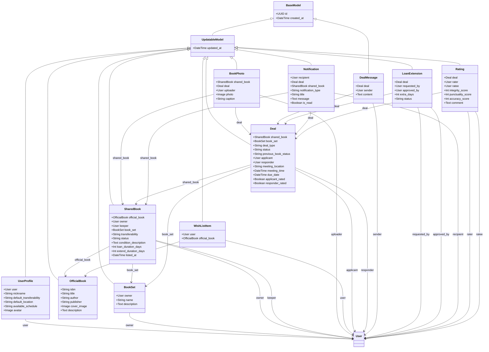
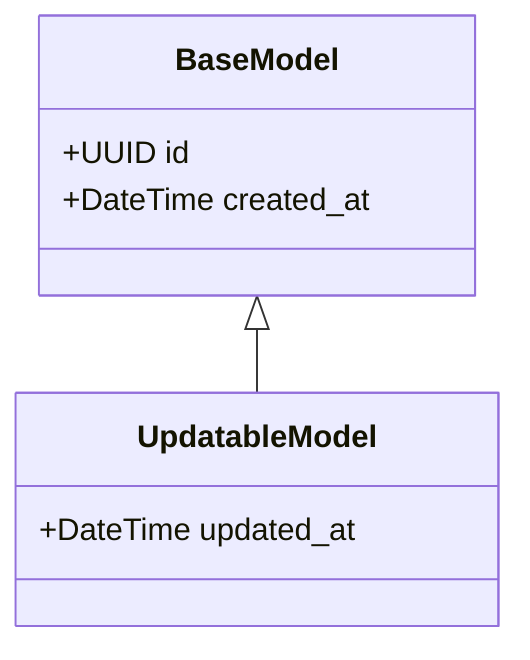
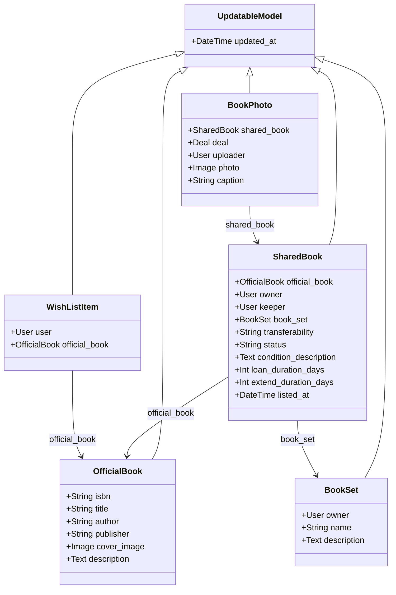
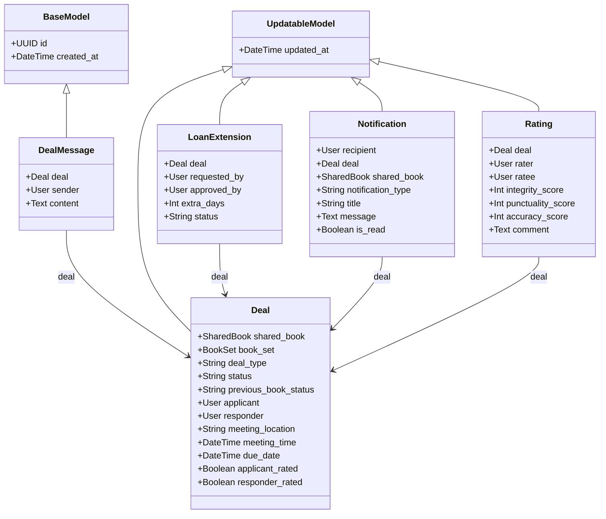

# Exbooks Class Diagram

## 整張圖

```mermaid
classDiagram
    %% Core Models
    class BaseModel {
        +UUID id
        +DateTime created_at
    }

    class UpdatableModel {
        +DateTime updated_at
    }

    BaseModel <|-- UpdatableModel

    %% Accounts Models
    class UserProfile {
        +User user
        +String nickname
        +String default_transferability
        +String default_location
        +String available_schedule
        +Image avatar
    }
    UpdatableModel <|-- UserProfile

    %% Books Models
    class OfficialBook {
        +String isbn
        +String title
        +String author
        +String publisher
        +Image cover_image
        +Text description
    }
    UpdatableModel <|-- OfficialBook

    class BookSet {
        +User owner
        +String name
        +Text description
    }
    UpdatableModel <|-- BookSet

    class SharedBook {
        +OfficialBook official_book
        +User owner
        +User keeper
        +BookSet book_set
        +String transferability
        +String status
        +Text condition_description
        +Int loan_duration_days
        +Int extend_duration_days
        +DateTime listed_at
    }
    UpdatableModel <|-- SharedBook

    class BookPhoto {
        +SharedBook shared_book
        +Deal deal
        +User uploader
        +Image photo
        +String caption
    }
    UpdatableModel <|-- BookPhoto

    class WishListItem {
        +User user
        +OfficialBook official_book
    }
    UpdatableModel <|-- WishListItem

    %% Deals Models
    class Deal {
        +SharedBook shared_book
        +BookSet book_set
        +String deal_type
        +String status
        +String previous_book_status
        +User applicant
        +User responder
        +String meeting_location
        +DateTime meeting_time
        +DateTime due_date
        +Boolean applicant_rated
        +Boolean responder_rated
    }
    UpdatableModel <|-- Deal

    class DealMessage {
        +Deal deal
        +User sender
        +Text content
    }
    BaseModel <|-- DealMessage

    class LoanExtension {
        +Deal deal
        +User requested_by
        +User approved_by
        +Int extra_days
        +String status
    }
    UpdatableModel <|-- LoanExtension

    class Notification {
        +User recipient
        +Deal deal
        +SharedBook shared_book
        +String notification_type
        +String title
        +Text message
        +Boolean is_read
    }
    UpdatableModel <|-- Notification

    class Rating {
        +Deal deal
        +User rater
        +User ratee
        +Int integrity_score
        +Int punctuality_score
        +Int accuracy_score
        +Text comment
    }
    UpdatableModel <|-- Rating

    %% Relationships
    UserProfile --> User : user
    BookSet --> User : owner
    SharedBook --> OfficialBook : official_book
    SharedBook --> User : owner
    SharedBook --> User : keeper
    SharedBook --> BookSet : book_set
    BookPhoto --> SharedBook : shared_book
    BookPhoto --> Deal : deal
    BookPhoto --> User : uploader
    WishListItem --> User : user
    WishListItem --> OfficialBook : official_book
    Deal --> SharedBook : shared_book
    Deal --> BookSet : book_set
    Deal --> User : applicant
    Deal --> User : responder
    DealMessage --> Deal : deal
    DealMessage --> User : sender
    LoanExtension --> Deal : deal
    LoanExtension --> User : requested_by
    LoanExtension --> User : approved_by
    Notification --> User : recipient
    Notification --> Deal : deal
    Notification --> SharedBook : shared_book
    Rating --> Deal : deal
    Rating --> User : rater
    Rating --> User : ratee
```

## Core

```mermaid
classDiagram
    class BaseModel {
        +UUID id
        +DateTime created_at
    }

    class UpdatableModel {
        +DateTime updated_at
    }

    BaseModel <|-- UpdatableModel
```

## Books

```mermaid
classDiagram
    class UpdatableModel {
        +DateTime updated_at
    }

    class OfficialBook {
        +String isbn
        +String title
        +String author
        +String publisher
        +Image cover_image
        +Text description
    }

    class BookSet {
        +User owner
        +String name
        +Text description
    }

    class SharedBook {
        +OfficialBook official_book
        +User owner
        +User keeper
        +BookSet book_set
        +String transferability
        +String status
        +Text condition_description
        +Int loan_duration_days
        +Int extend_duration_days
        +DateTime listed_at
    }

    class BookPhoto {
        +SharedBook shared_book
        +Deal deal
        +User uploader
        +Image photo
        +String caption
    }

    class WishListItem {
        +User user
        +OfficialBook official_book
    }

    UpdatableModel <|-- OfficialBook
    UpdatableModel <|-- BookSet
    UpdatableModel <|-- SharedBook
    UpdatableModel <|-- BookPhoto
    UpdatableModel <|-- WishListItem

    SharedBook --> OfficialBook : official_book
    SharedBook --> BookSet : book_set
    BookPhoto --> SharedBook : shared_book
    WishListItem --> OfficialBook : official_book
```

## Deals

```mermaid
classDiagram
    class UpdatableModel {
        +DateTime updated_at
    }

    class BaseModel {
        +UUID id
        +DateTime created_at
    }

    class Deal {
        +SharedBook shared_book
        +BookSet book_set
        +String deal_type
        +String status
        +String previous_book_status
        +User applicant
        +User responder
        +String meeting_location
        +DateTime meeting_time
        +DateTime due_date
        +Boolean applicant_rated
        +Boolean responder_rated
    }

    class DealMessage {
        +Deal deal
        +User sender
        +Text content
    }

    class LoanExtension {
        +Deal deal
        +User requested_by
        +User approved_by
        +Int extra_days
        +String status
    }

    class Notification {
        +User recipient
        +Deal deal
        +SharedBook shared_book
        +String notification_type
        +String title
        +Text message
        +Boolean is_read
    }

    class Rating {
        +Deal deal
        +User rater
        +User ratee
        +Int integrity_score
        +Int punctuality_score
        +Int accuracy_score
        +Text comment
    }

    UpdatableModel <|-- Deal
    UpdatableModel <|-- LoanExtension
    UpdatableModel <|-- Notification
    UpdatableModel <|-- Rating
    BaseModel <|-- DealMessage

    DealMessage --> Deal : deal
    LoanExtension --> Deal : deal
    Notification --> Deal : deal
    Rating --> Deal : deal
```