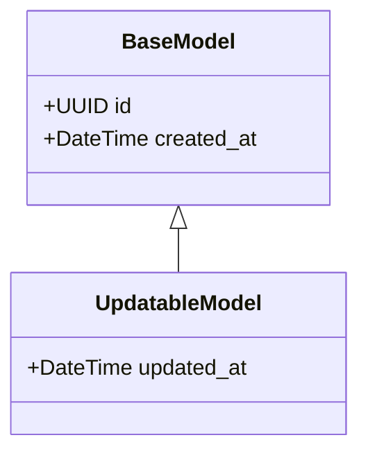
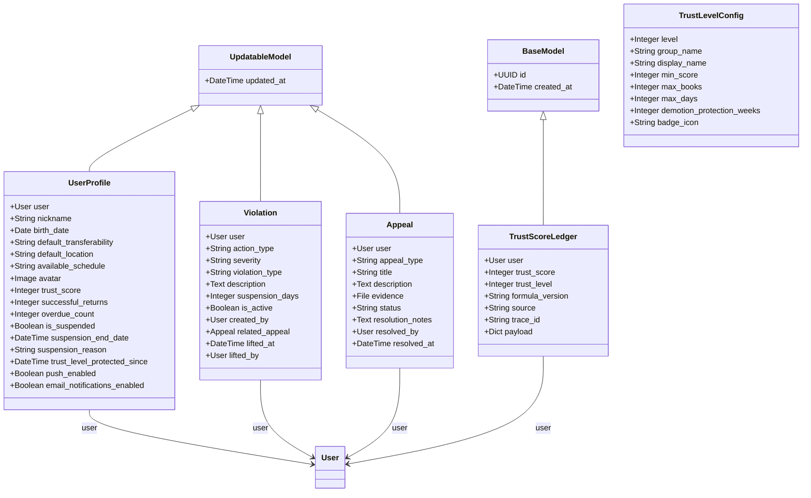
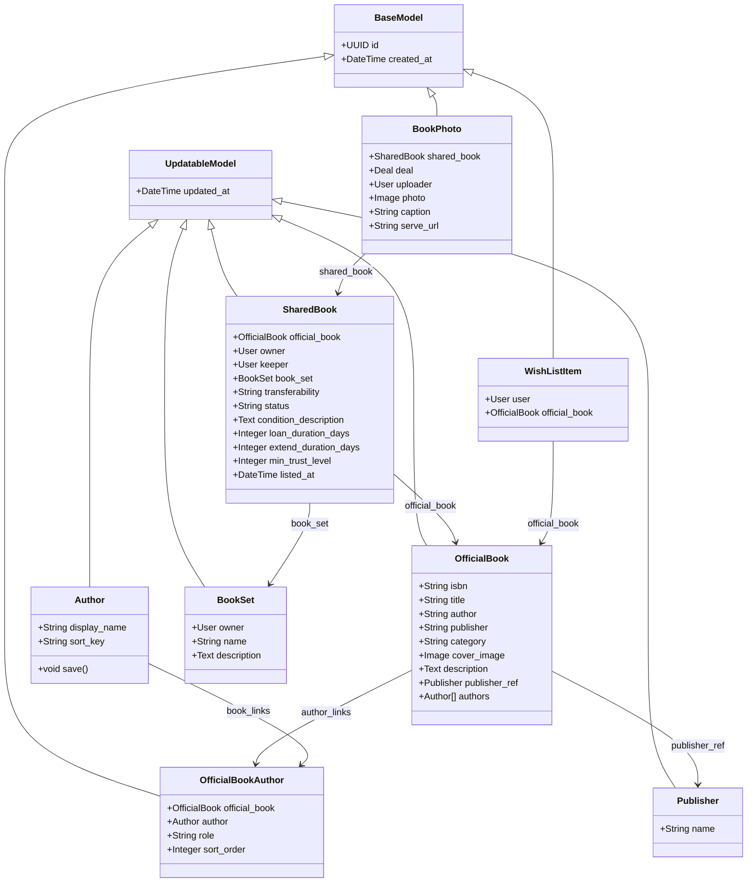
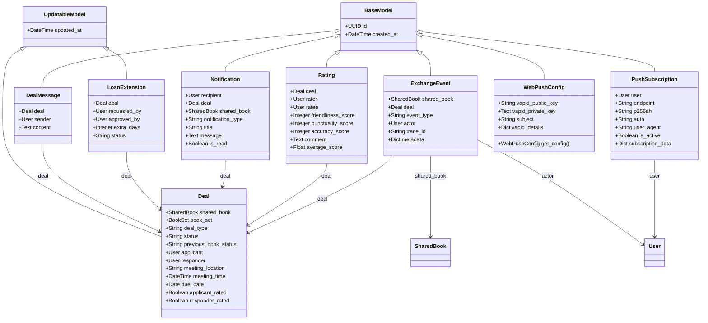

# Exbooks Class Diagram

## 整張圖

```mermaid
classDiagram
    %% Core Models
    class BaseModel {
        +UUID id
        +DateTime created_at
    }

    class UpdatableModel {
        +DateTime updated_at
    }

    BaseModel <|-- UpdatableModel

    %% Accounts Models
    class UserProfile {
        +User user
        +String nickname
        +Date birth_date
        +String default_transferability
        +String default_location
        +String available_schedule
        +Image avatar
        +Integer trust_score
        +Integer successful_returns
        +Integer overdue_count
        +Boolean is_suspended
        +DateTime suspension_end_date
        +String suspension_reason
        +DateTime trust_level_protected_since
        +Boolean push_enabled
        +Boolean email_notifications_enabled
    }
    UpdatableModel <|-- UserProfile

    class Violation {
        +User user
        +String action_type
        +String severity
        +String violation_type
        +Text description
        +Integer suspension_days
        +Boolean is_active
        +User created_by
        +Appeal related_appeal
        +DateTime lifted_at
        +User lifted_by
    }
    UpdatableModel <|-- Violation

    class Appeal {
        +User user
        +String appeal_type
        +String title
        +Text description
        +File evidence
        +String status
        +Text resolution_notes
        +User resolved_by
        +DateTime resolved_at
    }
    UpdatableModel <|-- Appeal

    class TrustLevelConfig {
        +Integer level
        +String group_name
        +String display_name
        +Integer min_score
        +Integer max_books
        +Integer max_days
        +Integer demotion_protection_weeks
        +String badge_icon
    }

    class TrustScoreLedger {
        +User user
        +Integer trust_score
        +Integer trust_level
        +String formula_version
        +String source
        +String trace_id
        +Dict payload
    }
    BaseModel <|-- TrustScoreLedger

    %% Books Models
    class OfficialBook {
        +String isbn
        +String title
        +String author
        +String publisher
        +String category
        +Image cover_image
        +Text description
        +Publisher publisher_ref
        +Author[] authors
    }
    UpdatableModel <|-- OfficialBook

    class Author {
        +String display_name
        +String sort_key
        +void save()
    }
    UpdatableModel <|-- Author

    class Publisher {
        +String name
    }
    UpdatableModel <|-- Publisher

    class OfficialBookAuthor {
        +OfficialBook official_book
        +Author author
        +String role
        +Integer sort_order
    }
    BaseModel <|-- OfficialBookAuthor

    class BookSet {
        +User owner
        +String name
        +Text description
    }
    UpdatableModel <|-- BookSet

    class SharedBook {
        +OfficialBook official_book
        +User owner
        +User keeper
        +BookSet book_set
        +String transferability
        +String status
        +Text condition_description
        +Integer loan_duration_days
        +Integer extend_duration_days
        +Integer min_trust_level
        +DateTime listed_at
    }
    UpdatableModel <|-- SharedBook

    class BookPhoto {
        +SharedBook shared_book
        +Deal deal
        +User uploader
        +Image photo
        +String caption
        +String serve_url
    }
    BaseModel <|-- BookPhoto

    class WishListItem {
        +User user
        +OfficialBook official_book
    }
    BaseModel <|-- WishListItem

    %% Deals Models
    class Deal {
        +SharedBook shared_book
        +BookSet book_set
        +String deal_type
        +String status
        +String previous_book_status
        +User applicant
        +User responder
        +String meeting_location
        +DateTime meeting_time
        +Date due_date
        +Boolean applicant_rated
        +Boolean responder_rated
    }
    UpdatableModel <|-- Deal

    class DealMessage {
        +Deal deal
        +User sender
        +Text content
    }
    BaseModel <|-- DealMessage

    class LoanExtension {
        +Deal deal
        +User requested_by
        +User approved_by
        +Integer extra_days
        +String status
    }
    UpdatableModel <|-- LoanExtension

    class Notification {
        +User recipient
        +Deal deal
        +SharedBook shared_book
        +String notification_type
        +String title
        +Text message
        +Boolean is_read
    }
    BaseModel <|-- Notification

    class Rating {
        +Deal deal
        +User rater
        +User ratee
        +Integer friendliness_score
        +Integer punctuality_score
        +Integer accuracy_score
        +Text comment
        +Float average_score
    }
    BaseModel <|-- Rating

    class ExchangeEvent {
        +SharedBook shared_book
        +Deal deal
        +String event_type
        +User actor
        +String trace_id
        +Dict metadata
    }
    BaseModel <|-- ExchangeEvent

    class PushSubscription {
        +User user
        +String endpoint
        +String p256dh
        +String auth
        +String user_agent
        +Boolean is_active
        +Dict subscription_data
    }
    BaseModel <|-- PushSubscription

    class WebPushConfig {
        +String vapid_public_key
        +Text vapid_private_key
        +String subject
        +WebPushConfig get_config()
        +Dict vapid_details
    }
    BaseModel <|-- WebPushConfig

    %% Relationships
    UserProfile --> User : user
    Violation --> User : user
    Violation --> User : created_by
    Violation --> User : lifted_by
    Violation --> Appeal : related_appeal
    Appeal --> User : user
    Appeal --> User : resolved_by
    TrustScoreLedger --> User : user
    OfficialBook --> Publisher : publisher_ref
    OfficialBook --> OfficialBookAuthor : author_links
    Author --> OfficialBookAuthor : book_links
    BookSet --> User : owner
    SharedBook --> OfficialBook : official_book
    SharedBook --> User : owner
    SharedBook --> User : keeper
    SharedBook --> BookSet : book_set
    BookPhoto --> SharedBook : shared_book
    BookPhoto --> Deal : deal
    BookPhoto --> User : uploader
    WishListItem --> User : user
    WishListItem --> OfficialBook : official_book
    Deal --> SharedBook : shared_book
    Deal --> BookSet : book_set
    Deal --> User : applicant
    Deal --> User : responder
    DealMessage --> Deal : deal
    DealMessage --> User : sender
    LoanExtension --> Deal : deal
    LoanExtension --> User : requested_by
    LoanExtension --> User : approved_by
    Notification --> User : recipient
    Notification --> Deal : deal
    Notification --> SharedBook : shared_book
    Rating --> Deal : deal
    Rating --> User : rater
    Rating --> User : ratee
    ExchangeEvent --> SharedBook : shared_book
    ExchangeEvent --> Deal : deal
    ExchangeEvent --> User : actor
    PushSubscription --> User : user
```

## Core

```mermaid
classDiagram
    class BaseModel {
        +UUID id
        +DateTime created_at
    }

    class UpdatableModel {
        +DateTime updated_at
    }

    BaseModel <|-- UpdatableModel
```

## Accounts

```mermaid
classDiagram
    class UpdatableModel {
        +DateTime updated_at
    }

    class BaseModel {
        +UUID id
        +DateTime created_at
    }

    class UserProfile {
        +User user
        +String nickname
        +Date birth_date
        +String default_transferability
        +String default_location
        +String available_schedule
        +Image avatar
        +Integer trust_score
        +Integer successful_returns
        +Integer overdue_count
        +Boolean is_suspended
        +DateTime suspension_end_date
        +String suspension_reason
        +DateTime trust_level_protected_since
        +Boolean push_enabled
        +Boolean email_notifications_enabled
    }

    class Violation {
        +User user
        +String action_type
        +String severity
        +String violation_type
        +Text description
        +Integer suspension_days
        +Boolean is_active
        +User created_by
        +Appeal related_appeal
        +DateTime lifted_at
        +User lifted_by
    }

    class Appeal {
        +User user
        +String appeal_type
        +String title
        +Text description
        +File evidence
        +String status
        +Text resolution_notes
        +User resolved_by
        +DateTime resolved_at
    }

    class TrustLevelConfig {
        +Integer level
        +String group_name
        +String display_name
        +Integer min_score
        +Integer max_books
        +Integer max_days
        +Integer demotion_protection_weeks
        +String badge_icon
    }

    class TrustScoreLedger {
        +User user
        +Integer trust_score
        +Integer trust_level
        +String formula_version
        +String source
        +String trace_id
        +Dict payload
    }

    UpdatableModel <|-- UserProfile
    UpdatableModel <|-- Violation
    UpdatableModel <|-- Appeal
    BaseModel <|-- TrustScoreLedger

    UserProfile --> User : user
    Violation --> User : user
    Appeal --> User : user
    TrustScoreLedger --> User : user
```

## Books

```mermaid
classDiagram
    class UpdatableModel {
        +DateTime updated_at
    }

    class BaseModel {
        +UUID id
        +DateTime created_at
    }

    class OfficialBook {
        +String isbn
        +String title
        +String author
        +String publisher
        +String category
        +Image cover_image
        +Text description
        +Publisher publisher_ref
        +Author[] authors
    }

    class Author {
        +String display_name
        +String sort_key
        +void save()
    }

    class Publisher {
        +String name
    }

    class OfficialBookAuthor {
        +OfficialBook official_book
        +Author author
        +String role
        +Integer sort_order
    }

    class BookSet {
        +User owner
        +String name
        +Text description
    }

    class SharedBook {
        +OfficialBook official_book
        +User owner
        +User keeper
        +BookSet book_set
        +String transferability
        +String status
        +Text condition_description
        +Integer loan_duration_days
        +Integer extend_duration_days
        +Integer min_trust_level
        +DateTime listed_at
    }

    class BookPhoto {
        +SharedBook shared_book
        +Deal deal
        +User uploader
        +Image photo
        +String caption
        +String serve_url
    }

    class WishListItem {
        +User user
        +OfficialBook official_book
    }

    UpdatableModel <|-- OfficialBook
    UpdatableModel <|-- Author
    UpdatableModel <|-- Publisher
    UpdatableModel <|-- BookSet
    UpdatableModel <|-- SharedBook
    BaseModel <|-- OfficialBookAuthor
    BaseModel <|-- BookPhoto
    BaseModel <|-- WishListItem

    OfficialBook --> Publisher : publisher_ref
    OfficialBook --> OfficialBookAuthor : author_links
    Author --> OfficialBookAuthor : book_links
    SharedBook --> OfficialBook : official_book
    SharedBook --> BookSet : book_set
    BookPhoto --> SharedBook : shared_book
    WishListItem --> OfficialBook : official_book
```

## Deals

```mermaid
classDiagram
    class UpdatableModel {
        +DateTime updated_at
    }

    class BaseModel {
        +UUID id
        +DateTime created_at
    }

    class Deal {
        +SharedBook shared_book
        +BookSet book_set
        +String deal_type
        +String status
        +String previous_book_status
        +User applicant
        +User responder
        +String meeting_location
        +DateTime meeting_time
        +Date due_date
        +Boolean applicant_rated
        +Boolean responder_rated
    }

    class DealMessage {
        +Deal deal
        +User sender
        +Text content
    }

    class LoanExtension {
        +Deal deal
        +User requested_by
        +User approved_by
        +Integer extra_days
        +String status
    }

    class Notification {
        +User recipient
        +Deal deal
        +SharedBook shared_book
        +String notification_type
        +String title
        +Text message
        +Boolean is_read
    }

    class Rating {
        +Deal deal
        +User rater
        +User ratee
        +Integer friendliness_score
        +Integer punctuality_score
        +Integer accuracy_score
        +Text comment
        +Float average_score
    }

    class ExchangeEvent {
        +SharedBook shared_book
        +Deal deal
        +String event_type
        +User actor
        +String trace_id
        +Dict metadata
    }

    class PushSubscription {
        +User user
        +String endpoint
        +String p256dh
        +String auth
        +String user_agent
        +Boolean is_active
        +Dict subscription_data
    }

    class WebPushConfig {
        +String vapid_public_key
        +Text vapid_private_key
        +String subject
        +WebPushConfig get_config()
        +Dict vapid_details
    }

    UpdatableModel <|-- Deal
    UpdatableModel <|-- LoanExtension
    BaseModel <|-- DealMessage
    BaseModel <|-- Notification
    BaseModel <|-- Rating
    BaseModel <|-- ExchangeEvent
    BaseModel <|-- PushSubscription
    BaseModel <|-- WebPushConfig

    DealMessage --> Deal : deal
    LoanExtension --> Deal : deal
    Notification --> Deal : deal
    Rating --> Deal : deal
    ExchangeEvent --> SharedBook : shared_book
    ExchangeEvent --> Deal : deal
    ExchangeEvent --> User : actor
    PushSubscription --> User : user
```
