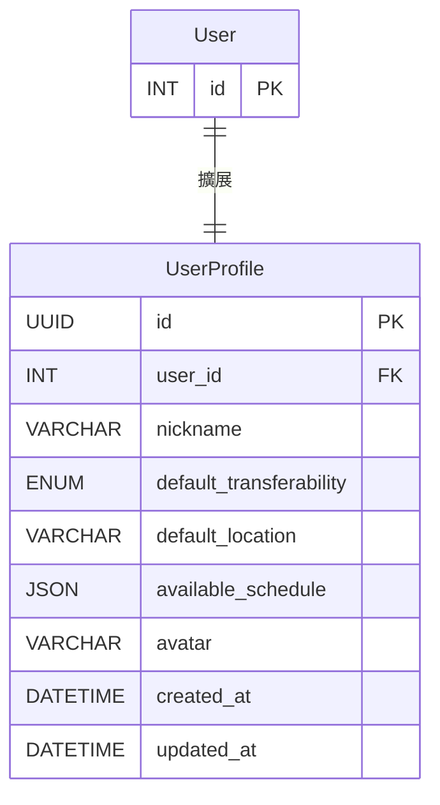
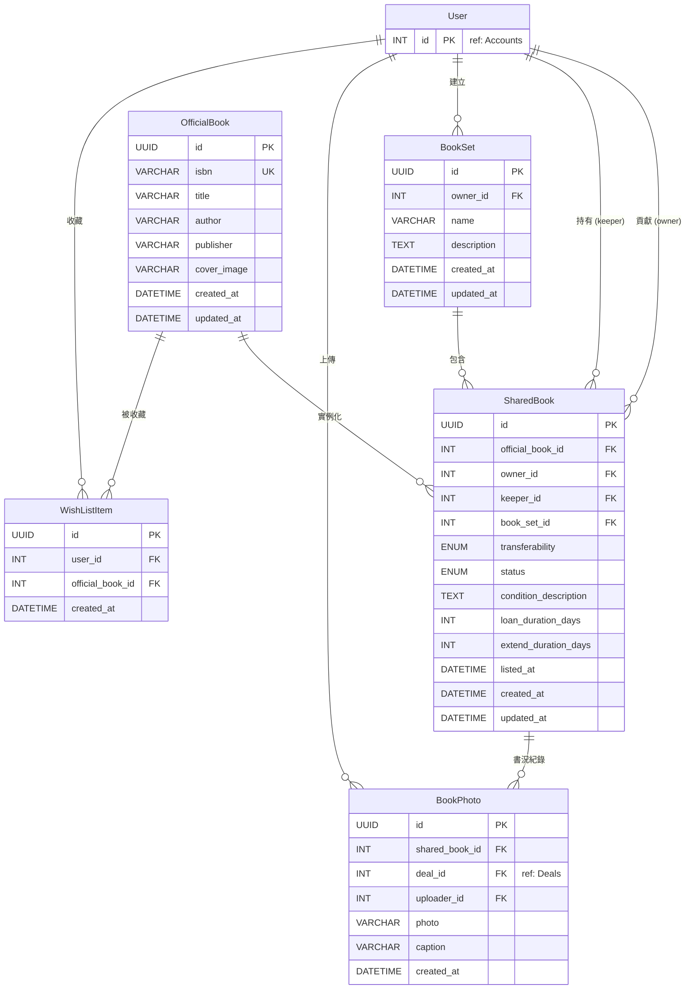
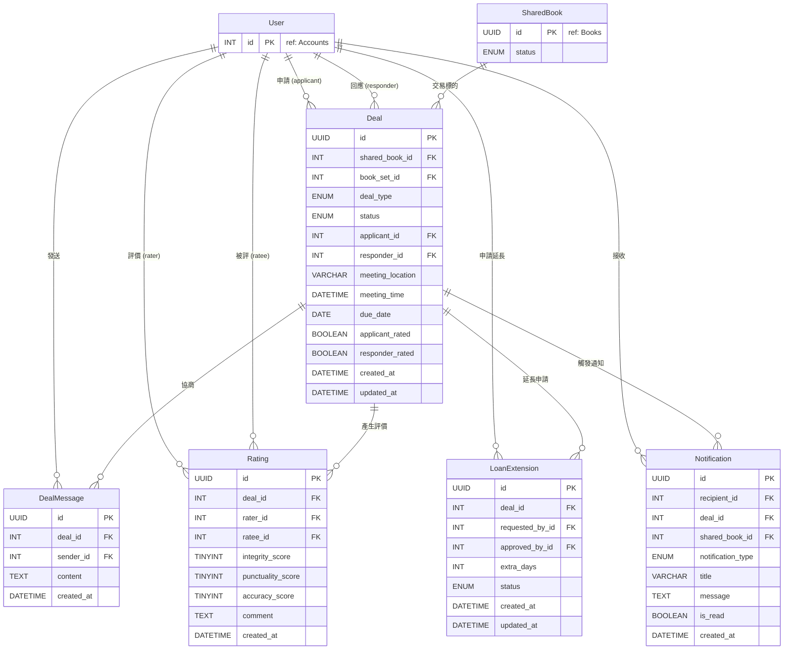

## ER Diagram

## Accounts Detail

```mermaid
erDiagram
    User ||--|| UserProfile : "擴展"

    User {
        INT id PK
    }

    UserProfile {
        UUID id PK
        INT user_id FK
        VARCHAR nickname
        ENUM default_transferability
        VARCHAR default_location
        JSON available_schedule
        VARCHAR avatar
        DATETIME created_at
        DATETIME updated_at
    }
```

## Books Detail

```mermaid
erDiagram
    User ||--o{ SharedBook : "貢獻 (owner)"
    User ||--o{ SharedBook : "持有 (keeper)"
    User ||--o{ BookSet : "建立"
    User ||--o{ BookPhoto : "上傳"
    User ||--o{ WishListItem : "收藏"

    OfficialBook ||--o{ SharedBook : "實例化"
    OfficialBook ||--o{ WishListItem : "被收藏"
    BookSet ||--o{ SharedBook : "包含"
    SharedBook ||--o{ BookPhoto : "書況紀錄"

    User {
        INT id PK "ref: Accounts"
    }

    OfficialBook {
        UUID id PK
        VARCHAR isbn UK
        VARCHAR title
        VARCHAR author
        VARCHAR publisher
        VARCHAR cover_image
        DATETIME created_at
        DATETIME updated_at
    }

    BookSet {
        UUID id PK
        INT owner_id FK
        VARCHAR name
        TEXT description
        DATETIME created_at
        DATETIME updated_at
    }

    SharedBook {
        UUID id PK
        INT official_book_id FK
        INT owner_id FK
        INT keeper_id FK
        INT book_set_id FK
        ENUM transferability
        ENUM status
        TEXT condition_description
        INT loan_duration_days
        INT extend_duration_days
        DATETIME listed_at
        DATETIME created_at
        DATETIME updated_at
    }

    BookPhoto {
        UUID id PK
        INT shared_book_id FK
        INT deal_id FK "ref: Deals"
        INT uploader_id FK
        VARCHAR photo
        VARCHAR caption
        DATETIME created_at
    }

    WishListItem {
        UUID id PK
        INT user_id FK
        INT official_book_id FK
        DATETIME created_at
    }
```

## Deals Detail

```mermaid
erDiagram
    User ||--o{ Deal : "申請 (applicant)"
    User ||--o{ Deal : "回應 (responder)"
    User ||--o{ DealMessage : "發送"
    User ||--o{ Rating : "評價 (rater)"
    User ||--o{ Rating : "被評 (ratee)"
    User ||--o{ LoanExtension : "申請延長"
    User ||--o{ Notification : "接收"

    SharedBook ||--o{ Deal : "交易標的"
    Deal ||--o{ DealMessage : "協商"
    Deal ||--o{ Rating : "產生評價"
    Deal ||--o{ LoanExtension : "延長申請"
    Deal ||--o{ Notification : "觸發通知"

    User {
        INT id PK "ref: Accounts"
    }

    SharedBook {
        UUID id PK "ref: Books"
        ENUM status
    }

    Deal {
        UUID id PK
        INT shared_book_id FK
        INT book_set_id FK
        ENUM deal_type
        ENUM status
        INT applicant_id FK
        INT responder_id FK
        VARCHAR meeting_location
        DATETIME meeting_time
        DATE due_date
        BOOLEAN applicant_rated
        BOOLEAN responder_rated
        DATETIME created_at
        DATETIME updated_at
    }

    DealMessage {
        UUID id PK
        INT deal_id FK
        INT sender_id FK
        TEXT content
        DATETIME created_at
    }

    Rating {
        UUID id PK
        INT deal_id FK
        INT rater_id FK
        INT ratee_id FK
        TINYINT integrity_score
        TINYINT punctuality_score
        TINYINT accuracy_score
        TEXT comment
        DATETIME created_at
    }

    LoanExtension {
        UUID id PK
        INT deal_id FK
        INT requested_by_id FK
        INT approved_by_id FK
        INT extra_days
        ENUM status
        DATETIME created_at
        DATETIME updated_at
    }

    Notification {
        UUID id PK
        INT recipient_id FK
        INT deal_id FK
        INT shared_book_id FK
        ENUM notification_type
        VARCHAR title
        TEXT message
        BOOLEAN is_read
        DATETIME created_at
    }
```