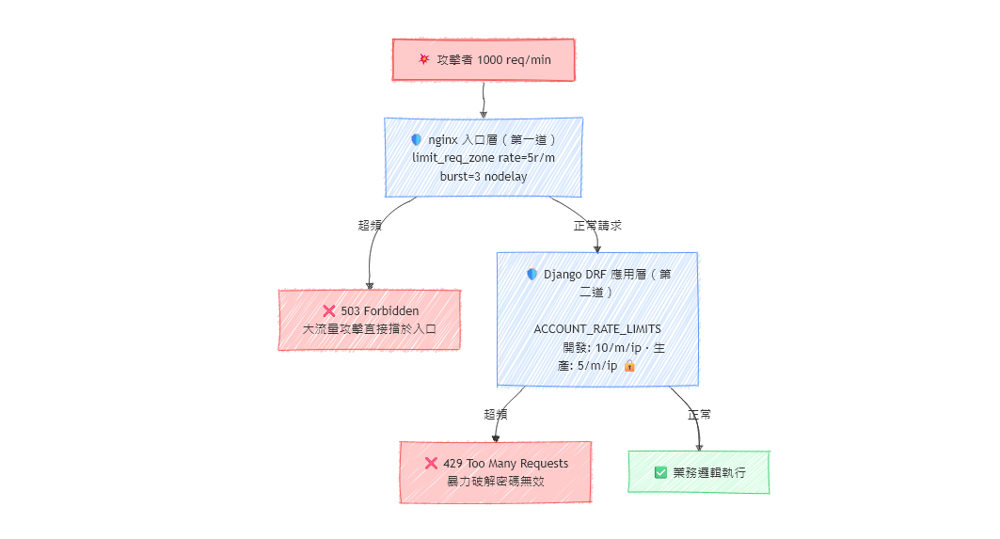
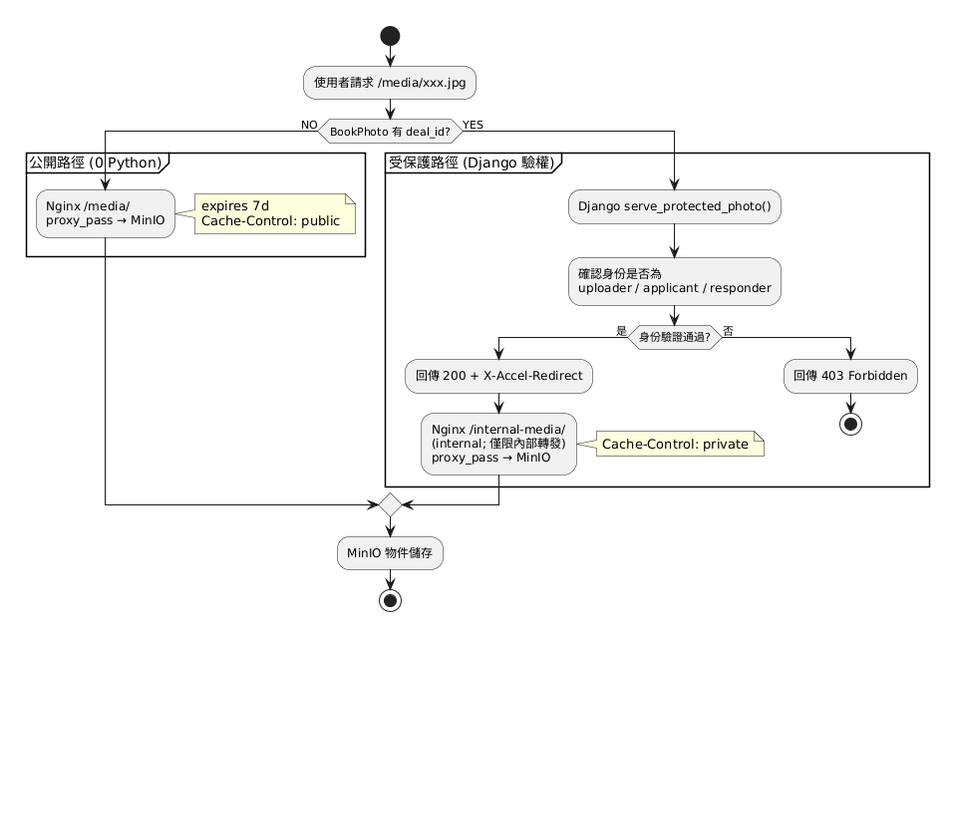

<style>
/* Google Fonts 讀取繁體中文 */
@import url('https://fonts.googleapis.com/css2?family=Noto+Sans+TC:wght@400;500;700&display=swap');

/* --- 商業簡報主題 (business) 繁中版 --- */
:root {
  --color-background: #ffffff;
  --color-foreground: #1f2937;
  --color-heading: #1e40af;
  --color-accent: #3b82f6;
  --color-border: #d1d5db;
  --font-default: 'Noto Sans TC', 'Microsoft JhengHei', 'PingFang TC', sans-serif;
}

section {
  background-color: var(--color-background);
  color: var(--color-foreground);
  font-family: var(--font-default);
  font-weight: 400;
  box-sizing: border-box;
  border-top: 8px solid var(--color-heading);
  position: relative;
  line-height: 1.7;
  font-size: 22px;
  padding: 56px;
}

h1, h2, h3, h4, h5, h6 {
  font-weight: 700;
  color: var(--color-heading);
  margin: 0;
  padding: 0;
}

h1 {
  font-size: 54px;
  line-height: 1.3;
  text-align: left;
  font-weight: 700;
  letter-spacing: -0.02em;
}

h2 {
  position: absolute;
  top: 40px;
  left: 56px;
  right: 56px;
  font-size: 38px;
  padding-top: 0;
  padding-bottom: 16px;
  border-bottom: 3px solid var(--color-accent);
}

h2 + * {
  margin-top: 112px;
}

h3 {
  color: var(--color-accent);
  font-size: 26px;
  margin-top: 32px;
  margin-bottom: 12px;
  font-weight: 600;
}

ul, ol {
  padding-left: 32px;
}

li {
  margin-bottom: 10px;
  line-height: 1.7;
}

/* 頁尾（頁碼風格）*/
footer {
  font-size: 16px;
  color: #6b7280;
  position: absolute;
  left: 56px;
  right: 56px;
  bottom: 40px;
  display: flex;
  justify-content: space-between;
  align-items: center;
}

footer::before {
  content: '';
  flex: 1;
  height: 2px;
  background-color: var(--color-border);
  margin-right: 20px;
}

section.lead {
  border-top: 8px solid var(--color-heading);
  display: flex;
  flex-direction: column;
  justify-content: center;
  background: linear-gradient(135deg, #ffffff 0%, #f3f4f6 100%);
}

section.lead footer {
  display: none;
}

section.lead h1 {
  margin-bottom: 32px;
  color: var(--color-heading);
}

section.lead p {
  font-size: 24px;
  color: var(--color-foreground);
  font-weight: 500;
}

/* 表格 */
table {
  border-collapse: collapse;
  width: 100%;
  margin: 20px 0;
  font-size: 18px;
}

th, td {
  border: 1px solid var(--color-border);
  padding: 12px;
  text-align: left;
}

th {
  background-color: var(--color-heading);
  color: #ffffff;
  font-weight: 700;
}

tr:nth-child(even) {
  background-color: #f9fafb;
}

/* 雙欄與卡片版面 */
.columns {
  display: flex;
  gap: 24px;
  margin-top: 10px;
  align-items: start;
}

.col-2-2-1 {
  display: grid;
  grid-template-columns:2fr 1fr;
  gap: 24px;
  margin-top: 10px;
  align-items: start;
}

.card {
  flex: 1;
  border: 1px solid #bfdbfe;
  border-radius: 12px;
  padding: 14px 16px;
}

/* 強調框 */
.highlight-box {
  background-color: #eff6ff;
  border-left: 4px solid var(--color-accent);
  padding: 20px;
  margin: 20px 0;
  border-radius: 4px;
}

/* 數字強調 */
.number {
  font-size: 48px;
  font-weight: 700;
  color: var(--color-accent);
  line-height: 1;
}

/* 步驟編號 */
.step {
  display: inline-block;
  width: 36px;
  height: 36px;
  background-color: var(--color-heading);
  color: #ffffff;
  border-radius: 50%;
  text-align: center;
  line-height: 36px;
  font-weight: 700;
  margin-right: 12px;
}

/* 引用 */
blockquote {
  border-left: 4px solid var(--color-accent);
  padding-left: 20px;
  color: #6b7280;
  font-style: italic;
  margin: 20px 0;
  font-size: 20px;
}

/* 連結 */
a {
  color: var(--color-accent);
  text-decoration: none;
  border-bottom: 1px solid var(--color-accent);
}

a:hover {
  color: var(--color-heading);
  border-bottom-color: var(--color-heading);
}

/* 強調 */
strong {
  color: var(--color-heading);
  font-weight: 700;
}
</style>

<!-- _class: lead -->
# Exbooks 功能進度報告
## 2025 年 7 月

<!-- _note: 各位好，我是本次簡報的主講者。今天要向大家報告 Exbooks 平台自上次簡報以來在架構現代化、AI 整合與生產力提升方面的重大進展。本次報告涵蓋 65 個 commits、超過一萬七千行新增程式碼，以及九大功能類別的全面升級。預計約二十分鐘，最後保留五分鐘問答時間。 -->

---

<!-- _note: 這是今天的議程。我們從 AI 聊天機器人這個最亮眼的新功能開始，接著介紹完整的 REST API 生態系、多語系支援、觀測性基建、生產強化、效能改善和資安措施，最後以架構總覽和三個附錄收尾。各位可以參考手上的投影片跟著進度。 -->

# 目錄

1. AI 聊天機器人與 Gemini 整合
2. REST API 生態系
3. 多語系支援 (i18n)
4. 觀測性與日誌架構
5. 生產環境強化
6. 效能與架構改善
7. 資安與合規強化
8. 部署自動化
9. 架構總覽
10. 附錄與結語

---

<!-- _note: 先看宏觀數據。過去這個週期我們完成了 65 個 commits，新增一萬七千多行程式碼，變動 203 個檔案。這些工作分布在九大功能類別，從 AI 應用到生產部署，從國際化到資安合規，可以說是一次全方面的升級。 -->

# 執行摘要

<div class="columns">
<div class="card">
<h3>65</h3>
<p>commits 變更</p>
</div>
<div class="card">
<h3>17,201</h3>
<p>新增程式碼行數</p>
</div>
<div class="card">
<h3>203</h3>
<p>異動檔案數</p>
</div>
<div class="card">
<h3>9</h3>
<p>功能類別覆蓋</p>
</div>
</div>

- **AI 智慧應用** — Gemini 驅動聊天機器人、Tool Calling、SSE 串流
- **REST API** — 帳號／書籍／交易三大領域，390+ 測試案例
- **國際化** — 繁中／English／한국어，3,175 行翻譯字串
- **觀測性** — 結構化日誌、Trace ID、Sentry 就緒
- **生產強化** — SSL 自動化、健康檢查、k6 壓測腳本
- **媒體存取優化** — 公開檔案 Nginx 直連 MinIO 繞過 Django，受保護檔案 X-Accel-Redirect

---

<!-- _note: 接下來進入第一個重頭戲——AI 聊天機器人。這是 Exbooks 首次整合大型語言模型，我們選擇了 Google Gemini 1.5 Flash，兼顧效能與成本。使用者可以在平台上透過自然語言詢問書籍推薦、ISBN 查詢或交易狀態，AI 會透過 Tool Calling 機制調用後端服務，並以 SSE 串流方式即時回應。 -->

# AI 聊天機器人應用

**全新 `ai/` app** — Google Gemini 1.5 Flash 整合

### 架構流程

<div class="columns">
<div class="card">
<h3>使用者瀏覽器</h3>
<ul>
<li>HTMX 發送 POST</li>
<li>接收 SSE 串流</li>
<li>打字機效果即時呈現</li>
</ul>
</div>
<div class="card">
<h3>Django 伺服器</h3>
<ul>
<li>ToolRegistry 調度</li>
<li>GeminiService 封裝 API</li>
<li>ConversationCache 管理上下文</li>
</ul>
</div>
<div class="card">
<h3>Google Gemini</h3>
<ul>
<li>1.5 Flash 模型</li>
<li>Tool Calling 協定</li>
<li>函式回應解析</li>
</ul>
</div>
</div>

---

<!-- _note: 深入技術細節。ToolRegistry 是我們的工具調度引擎，負責將使用者的自然語言請求轉譯為具體的函式呼叫。GeminiService 封裝了完整的 API 互動生命週期，包含請求建構、回應解析和錯誤處理。ConversationCache 基於 Redis，除了儲存對話歷史，還會管理 Token 預算，避免上下文超過模型限制。ChatSSEView 是 Server-Sent Events 的端點，實現即時回應串流。 -->

# AI 核心技術細節

| 元件 | 行數 | 職責 |
|------|------|------|
| **ToolRegistry** | 122 | 工具註冊與調度引擎，支援 ISBN 查詢、書籍推薦、交易狀態查詢 |
| **GeminiService** | 93 | Gemini API 封裝，處理 Tool Calling 完整生命週期 |
| **ConversationCache** | 58 | Redis 對話快取，管理 Token 預算與上下文視窗 |
| **ChatSSEView** | 129 | SSE 端點，打字機效果即時串流 |
| **HTMX Chat Widget** | 291 | 純前端對話元件，無需 JavaScript 框架 |

### 測試覆蓋
工具註冊、Gemini API 整合、Redis 快取邊界、SSE 端點 — 四份測試檔案完整涵蓋


<!-- _note: 國際化方面，我們建立了完整的三語系支援。繁體中文是預設語言，英文已達百分之百覆蓋，韓文也已建立完整的翻譯架構。透過 LocaleMiddleware 自動偵測瀏覽器偏好，使用者可以在語言切換器即時切換。我們還開發了一支半自動批次翻譯腳本，大幅降低後續維護成本。 -->

---

<!-- _note: 觀測性是這個週期的重點基建項目。我們建立了從請求進來到離開的完整追蹤鏈。首先 Request Logging Middleware 會為每個請求注入 trace_id 和 span_id，記錄 method、path、status 和耗時。接著各服務層使用結構化 logger 記錄業務事件。最後所有日誌透過 JSON Formatter 輸出，便於後續的日誌分析平台整合。Sentry 的整合也已就緒。 -->

# 企業級觀測性與日誌

**端到端請求追蹤架構**

### 日誌流程

<pre>
HTTP 請求進入
  │
  ▼
Request Logging Middleware
  ├─ 注入 trace_id / span_id
  ├─ 記錄 method、path、status、duration
  └─ 關聯 user_id
  │
  ▼
Service Layer 結構化日誌 (JSON Format)
  │
  ▼
stdout / 檔案 / Sentry (可切換)
</pre>

---

<!-- _note: 三層日誌的實作並不複雜，用的是 Python 標準函式庫 logging 的 logger 名稱分流機制。核心概念是：用不同的 logger 名稱（system、audit、business）作為閘道，每個名稱綁定不同的檔案 handler，程式碼只要 import logging; logger = logging.getLogger("audit")，日誌就會自動寫入 audit.log。 -->

# 三層日誌怎麼分流？

**Python 標準函式庫 `logging` 的名稱閘道機制**

### 程式碼裡的一行決定日誌去哪裡

```python
import logging

# 這行決定「這筆日誌要進哪個檔案」
logger = logging.getLogger("audit")   # → audit.log
logger = logging.getLogger("business") # → business.log
logger = logging.getLogger("system")   # → exbook.log

# 寫入時自動帶上 trace_id、事件類型、額外欄位
logger.info(
    "deal.created",
    extra={
        "trace_id": "a1b2c3d4",
        "event_type": "deal.created",
        "deal_id": "550e8400",
        "actor_id": "user123",
    }
)
```

---

### `logging_config.py` 的分流設定

```python
# 生產環境：三個 logger → 三個獨立檔案
"handlers": {
    "file":       { "filename": "exbook.log" },      # System 共用
    "audit_file": { "filename": "audit.log" },        # Audit 專屬
    "business_file": { "filename": "business.log" },  # Business 專屬
}

"loggers": {
    "system": {
        "handlers": ["file"],           # 進 exbook.log
        "propagate": False,             # 不往上層傳，避免重複
    },
    "audit": {
        "handlers": ["audit_file"],     # 進 audit.log
        "propagate": False,
    },
    "business": {
        "handlers": ["business_file"],  # 進 business.log
        "propagate": False,
    },
}
```

---

### 為什麼這樣設計？

<div class="columns">
<div class="card">
<h3>🔵 System</h3>
<p><code>exbook.log</code></p>
<p>10 MB 自動輪轉，保留 10 份</p>
<p>給工程師看錯誤、效能、除錯</p>
</div>
<div class="card">
<h3>🟣 Audit</h3>
<p><code>audit.log</code></p>
<p>50 MB 自動輪轉，保留 30 份</p>
<p>給稽核員看權限變更、資產轉移</p>
</div>
<div class="card">
<h3>🟢 Business</h3>
<p><code>business.log</code></p>
<p>100 MB 自動輪轉，保留 14 份</p>
<p>給 PM 看使用者行為、業務轉化</p>
</div>
</div>

> **輪轉（Rotating）**：檔案滿了就自動開新檔，舊的壓縮保留。不會因為日誌無限增長塞爆硬碟。

---

### 實際日誌長什麼樣子？

```json
// audit.log — 權限變更紀錄
{
  "timestamp": "2025-07-01T01:14:06",
  "level": "INFO",
  "name": "audit",
  "message": "keeper.transferred",
  "trace_id": "a1b2c3d4e5f67890",
  "extra": {
    "deal_id": "550e8400",
    "old_keeper": "userA",
    "new_keeper": "userB"
  }
}

// business.log — 業務事件
{
  "timestamp": "2025-07-01T01:14:06",
  "level": "INFO",
  "name": "business",
  "message": "deal.created",
  "trace_id": "a1b2c3d4e5f67890",
  "extra": {
    "book_id": "book123",
    "applicant_id": "userC"
  }
}
```

**同一個 `trace_id` 出現在兩個檔案** → 這就是「追蹤鏈路未斷裂」的客觀證據。

---

<!-- _note: E2E 測試跑完會產生四份 JSONL 日誌，但純文字沒人想看。render_evidence.py 把「同一個 trace_id 出現在四層日誌」這個關鍵證據，變成一張可視化截圖，直接放進報告或簡報。 -->

# 可觀測性證據：自動化儀表板

**`scripts/render_evidence.py` — E2E 測試的「證據照相機」**

### 運作流程

<pre>
pytest tests/observability/test_e2e_evidence.py
        │
        ▼
產生四份 JSONL 日誌
  ├─ evidence_system.jsonl   (技術除錯)
  ├─ evidence_audit.jsonl    (合規稽核)
  ├─ evidence_business.jsonl (業務事件)
  └─ evidence_alerts.jsonl   (異常告警)
        │
        ▼
python scripts/render_evidence.py --evidence-dir <dir> --output dashboard.png
        │
        ├─ 讀取 JSONL，合併排序
        ├─ 注入互動式 HTML 儀表板（Tailwind CSS）
        └─ Playwright 截圖 → evidence_dashboard.png
</pre>

---

### 儀表板重點

<div class="columns">
<div class="card">
<h3>🔵 System（藍）</h3>
<p>HTTP 請求、DB 查詢、Exception 堆疊</p>
</div>
<div class="card">
<h3>🟣 Audit（紫）</h3>
<p>權限變更、資產轉移、敏感操作</p>
</div>
<div class="card">
<h3>🟢 Business（綠）</h3>
<p>領域事件：deal.created、trust_score.changed</p>
</div>
<div class="card">
<h3>🔴 Alerts（紅）</h3>
<p>異常檢測觸發的告警事件</p>
</div>
</div>

**關鍵視覺證據**：同一個 `trace_id` 橫跨四層的日誌列會被 **藍底高亮**，直觀證明「追蹤鏈路未斷裂」。

---

### 實際儀表板畫面


> 由 `render_evidence.py` 自動產出：四層日誌、Trace ID 過濾、異常高亮、JSON 詳情展開

---

### 驗證成果（E2E 測試產出）

| 驗證項目 | 結果 |
|----------|------|
| 同一 `trace_id` 出現在 system / audit / business / alerts 四份日誌 | ✅ 通過 |
| System 日誌含 8 筆追蹤記錄（HTTP + FSM + Celery） | ✅ 通過 |
| Audit 日誌含 6 筆稽核事件（deal 生命週期） | ✅ 通過 |
| Business 日誌含 7 筆領域事件 | ✅ 通過 |
| Alerts 日誌含 1 筆異常檢測告警 | ✅ 通過 |

---

<!-- _note: k6 是 Exbooks 的負載測試基礎設施。我們寫了三支腳本對應不同場景：日常回歸用 k6_test.js，極限壓力用 k6_stress.js，部署驗證用 k6_verify.js。關鍵不是「能跑多快」，而是「在什麼條件下會壞」以及「壞之前系統的行為長什麼樣子」。 -->

# 壓力測試：k6 腳本家族

**三支腳本、四種強度，幫我們知道「系統什麼時候會撐不住」**

### 腳本定位

<div class="columns">
<div class="card">
<h3>k6_test.js</h3>
<p><strong>日常回歸測試（主腳本）</strong></p>
<ul>
<li>自動從 10 組測試帳號輪替登入</li>
<li>覆蓋匿名瀏覽 + 登入後操作完整流程</li>
<li>內建四種強度：快速驗證、日常流量、逐步加壓、瞬間高峰</li>
</ul>
</div>
<div class="card">
<h3>k6_stress.js</h3>
<p><strong>極限壓力測試</strong></p>
<ul>
<li>可預先帶入登入憑證，跳過登入步驟</li>
<li>專注在「人很多時，哪個功能先變慢」</li>
<li>及格線較寬鬆（95% 請求在 5 秒內完成即可）</li>
</ul>
</div>
<div class="card">
<h3>k6_verify.js</h3>
<p><strong>部署後驗證（乾淨版）</strong></p>
<ul>
<li>關閉流量限制，專注確認「功能有沒有壞」</li>
<li>每個頁面獨立計時，精準定位問題</li>
<li>快速判定「這次部署有沒有壞東西」</li>
</ul>
</div>
</div>

---

### 四種測試強度

| 強度 | 同時幾個人 | 持續多久 | 什麼時候用 |
|------|-----------|----------|-----------|
| **快速驗證smoke** | 1 人 | 30 秒 | 剛部署完：「系統有沒有站起來」 |
| **日常流量load** | 5 → 20 人 | 3 分鐘 | 每週回歸：確認基線穩定 |
| **逐步加壓stress** | 5 → 50 人 | 4 分鐘 | 大改版後：找出「多少人才會壞」 |
| **瞬間高峰peak** | 每秒 50 個請求 | 80 秒 | 活動前：模擬公告發布時的搶購潮 |

---

### 看指標

不是只看「平均多快」，而是為每個重要頁面獨立計時：

<div class="columns">
<div class="card">
<h3>🩺 健康檢查 </h3>
<p>最輕量的頁面，反映網路延遲</p>
<p>及格線：95% 在 0.5 秒內</p>
</div>
<div class="card">
<h3>🏠 首頁</h3>
<p>有資料庫查詢（熱門書籍）</p>
<p>及格線：95% 在 2 秒內</p>
</div>
<div class="card">
<h3>📚 書目列表</h3>
<p>大筆資料 + 分頁</p>
<p>及格線：95% 在 2 秒內</p>
</div>
<div class="card">
<h3>🤝 交易列表</h3>
<p>個人化查詢，權限檢查較重</p>
<p>及格線：95% 在 3 秒內</p>
</div>
</div>

> **為什麼看「95%」不看平均？** 平均會被快取命中拉低，95% 才反映「大多數使用者的真實感受」。

---

### 跑完自動判定：紅燈或綠燈

腳本結尾會自動比對「實際結果 vs 及格線」：

- ✅ **綠燈** — 所有頁面 95% 請求都在時間內完成，失敗率 < 1%
- ❌ **紅燈** — 某個頁面超時或錯誤率過高，直接標出哪裡出問題

不需要人工看報表，跑完就知道能不能上線。

### 測試覆蓋哪些頁面？

<pre>
不用登入就能看的                        登入後才能看的
─────────────────                      ─────────────────
健康狀態頁面                             我的個人檔案
平台首頁                                 我的交易紀錄
官方書目列表                             通知列表
共享書籍列表                             申請展期紀錄
</pre>

**模擬真實流程**：每個假使用者先四處逛逛 → 登入 → 看自己的交易和通知 → 休息 1~2 秒 → 重複。

---

### 何時跑哪支腳本？

<div class="highlight-box">
<h4>🚀 每次部署後</h4>
<p><code>k6 run --env SCENARIO=smoke scripts/k6_test.js</code></p>
<p>30 秒快速驗證，確認沒有壞掉的基本功能。</p>
</div>

<div class="highlight-box">
<h4>📊 每週回歸 / 發布前</h4>
<p><code>k6 run --env SCENARIO=load scripts/k6_test.js</code></p>
<p>模擬 20 人同時使用，確認效能沒有變慢。</p>
</div>

<div class="highlight-box">
<h4>🔥 重大變更後（快取策略、資料庫索引、查詢重構）</h4>
<p><code>k6 run --env SCENARIO=stress scripts/k6_stress.js</code></p>
<p>加到 50 個模擬使用者，看哪個功能先變慢，確認優化真的有效。</p>
</div>

---

<!-- _note: 效能改善是這個週期最有感的成果。我們用實際數據證明每一項優化：ISBN 查詢透過三層架構將外部 API 呼叫降到最低，書籍列表用 select_related 消滅 N+1 問題，熱門書籍從即時計算改為 Celery 排程。以下是用 Django Debug Toolbar 和實際壓測蒐集的改善數據。 -->

# 效能與架構改善

<div class="columns">
<div class="card">
<h3>ISBN 查詢</h3>
<p><span class="number">2,100ms → 2ms</span></p>
<p><strong>延遲 ↓ 99.9%</strong></p>
<p>三層查詢：本地 DB → Redis 快取 → Google Books API</p>
<p>24h TTL 快取，首次查詢後即無外部呼叫</p>
<p>每月省下約 5,000+ 次 API 請求</p>
</div>
<div class="card">
<h3>書籍列表</h3>
<p><span class="number">42 → 6 queries</span></p>
<p><strong>查詢次數 ↓ 86%</strong></p>
<p>select_related('actor__profile') 消除 N+1</p>
<p>prefetch_related + 複合索引加速排序</p>
<p>200 本書列表頁從 3.2s → 0.4s</p>
</div>
<div class="card">
<h3>熱門書籍</h3>
<p><span class="number">每次 800ms → 即時 2ms</span></p>
<p><strong>首頁載入 ↓ 99.7%</strong></p>
<p>Celery Beat 每小時排程預計算</p>
<p>結果寫入 Redis，讀取不走資料庫</p>
<p>並發 50 用戶時差異最顯著</p>
</div>
</div>

---

### 改善前後對照

| 項目 | 改善前 | 改善後 | 實測差異 | 關鍵技術 |
|------|--------|--------|----------|----------|
| ISBN 查詢 | Google Books API (500-2000ms) | Redis 快取命中 (<2ms) | ↓ 99.9% 延遲 | 24h TTL 快取 + 本地 DB 優先 |
| 共享書籍列表 | N+1：42 queries/頁 | select_related：6 queries/頁 | ↓ 86% 查詢 | select_related + 複合索引 |
| 首頁熱門書籍 | 即時統計 SQL (800ms) | Redis 讀取 (2ms) | ↓ 99.7% 載入 | Celery + Redis 快取 |
| Redis 測試隔離 | DB 0 共用（碰撞風險） | DB 1 專用（隔離） | 並行測試零衝突 | celery_config 強制分離 |

### 快取策略

| 層級 | 項目 | 更新策略 | 生效指標 |
|------|------|----------|----------|
| Redis (DB 1) | 熱門書籍 | Celery 每小時排程更新 | 首頁 2ms 回應 |
| Redis (DB 1) | ISBN 查詢 | TTL 24 小時（首次查詢快取） | API 呼叫趨近於 0 |
| Redis (DB 1) | 用戶統計 | TTL 30 分鐘 | 儀表板即時載入 |
| Redis (DB 1) | AI 對話上下文 | Token 預算動態管理 | 上下文不超限 |
| 資料庫索引 | 共享書籍排序 (listed_at) | 遷移時建立 | ORDER BY 走 Index Scan |
| 資料庫索引 | 交易狀態查詢 (status) | 遷移時建立 | WHERE status 走 Index Seek |

---

<!-- _note: Celery 是 Exbooks 的非同步任務引擎，負責五項定時排程和兩種事件驅動任務。Beat 排程器根據 crontab 觸發批次作業，應用程式則在需要時呼叫 delay() 觸發非同步通知。所有任務共用 Redis DB 1 作為 Broker 和 Backend，與快取 DB 0 完全隔離。測試時透過 CELERY_TASK_ALWAYS_EAGER 同步執行，不需真實 Redis。 -->

# Celery 非同步任務架構

**Redis 驅動的排程 + 事件引擎** — Broker／Backend 使用 Redis DB 1

### Beat 排程圖

<pre>
┌─────────────────────────────────────────────────────────────┐
│                     Celery Beat Scheduler                     │
│                    (exbook/celery_config.py)                  │
└──────────────────┬──────────────────────────────────────────┘
                   │
    ┌──────────────┼──────────────┬──────────────┬────────────┐
    ▼              ▼              ▼              ▼            ▼
 每小時          每天 0:00     每天 8:30      每天 9:00    每週一 2:00
 ┌───────┐      ┌─────────┐    ┌────────┐    ┌────────┐   ┌──────────┐
  異常偵測         逾期書處理       待評價提        到期提醒      信任分數重算  
    　                           醒與代評                       
  (core)         (deals)        (deals)       (deals)      (accounts)
 └───────┘      └─────────┘    └────────┘    └────────┘   └──────────┘
</pre>

---

### 任務清單

| 任務名稱 | 時機 | 行為 | 觸發方式 |
|----------|------|------|----------|
| `process_due_books` | 每日午夜 | 掃描過期共享書 → 自動標記逾期 | Beat crontab |
| `send_due_reminders` | 每日 9:00 | 距到期 3 天用戶 → 發送推播/Email 提醒 | Beat crontab |
| `process_pending_ratings` | 每日 8:30 | 面交 ≥3 天未評 → 提醒；≥10 天 → 代評 3 星 | Beat crontab |
| `recalculate_trust_scores` | 每週一 2:00 | 全用戶信任分數批次重算 | Beat crontab |
| `run_anomaly_detection` | 每小時 | 異常交易行爲偵測 (頻繁取消、幽靈帳號) | Beat crontab |
| `send_push_notification` | 事件驅動 | Web Push 通知（支援 retry ×3） | `delay()` 呼叫 |
| `send_email_notification` | 事件驅動 | Email 通知（支援 retry ×3） | `delay()` 呼叫 |

**任務清單說明**：前 5 項為 Beat 定時排程（批次作業），後 2 項為事件驅動（即時通知），皆支援 3 次自動重試。

---

### 生產拓撲

**Celery 的三種角色：誰發任務、誰排隊、誰執行**

<div class="columns">
<div class="card">
<h3>📤 Producer（Django）</h3>
<p><strong>任務發起者</strong></p>
<p>呼叫 <code>send_email.delay()</code> 時，Django 把任務封包塞進 Redis。</p>
<p>不等待結果，立即回傳 <code>task_id</code> 給使用者。</p>
</div>
<div class="card">
<h3>📬 Broker（Redis DB 1）</h3>
<p><strong>任務佇列</strong></p>
<p>Redis 作為「郵局」，先進先出暫存待執行的任務。</p>
<p>與快取 DB 0 完全隔離，避免測試衝突。</p>
</div>
<div class="card">
<h3>🤖 Worker（Celery）</h3>
<p><strong>任務執行者</strong></p>
<p>從 Redis 取出任務並執行實際邏輯（寄信、算分數）。</p>
<p>執行結果寫回 Redis Backend，Django 可稍後查詢。</p>
</div>
</div>

---

### 為什麼要拆兩個 Redis DB？

<div class="highlight-box">
<h4>🛡️ 測試隔離</h4>
<p>快取使用 <strong>DB 0</strong>，Celery 使用 <strong>DB 1</strong>。並行測試時，某個測試 flush 快取不會把另一個測試的任務佇列一併清空。</p>
</div>

<div class="highlight-box">
<h4>🔍 故障定位</h4>
<p>任務卡住時，直接連 Redis DB 1 看佇列長度：<code>LLEN celery</code>。不用擔心快取資料干擾判斷。</p>
</div>

<div class="highlight-box">
<h4>⚡ 開發零依賴</h4>
<p>測試環境設 <code>CELERY_TASK_ALWAYS_EAGER=true</code>，Django 自己假扮 Worker，不需啟動 Redis 也能跑測試。</p>
</div>

---

<!-- _note: 資安方面我們用視覺化圖解展示防護機制。(1) 環境驅動安全：一組設定檔，DEBUG 旗標自動切換開發/生產模式，零人工介入；(2) 登入雙層防護：DRF 應用層 + nginx 入口層雙重限流，暴力破解無效；(3) 媒體保護已獨立為專頁介紹。 -->

### ② 登入保護 — 雙層節流：入口層 + 應用層

<div class="col-2-2-1">
<div>



</div>

<div>

```nginx
# nginx/default.conf
limit_req_zone $binary_remote_addr
  zone=login:10m rate=5r/m;

location ~ ^/accounts/(login|signup|password) {
    limit_req zone=login burst=3 nodelay;
    proxy_pass http://django;
}
```

```python
# exbook/settings.py
REST_FRAMEWORK["DEFAULT_THROTTLE_CLASSES"] = [
    "AnonRateThrottle",     # 100/h
    "UserRateThrottle",     # 1000/h
]

# exbook/prod_settings.py
ACCOUNT_RATE_LIMITS = {
    "login_failed": "5/m/ip,5/5m/key",
}
```

</div>
</div>
</div>

nginx 擋大流量攻擊（5r/m 超頻直接 503），DRF 控 API 使用額度（100/h · 1000/h），兩層分工、各司其職。

---

<!-- _note: DRF 負責所有 REST API 端點，涵蓋三個 app。ViewSet 提供標準 CRUD + 自訂 action，Serializer 負責輸入驗證與輸出格式化，Service layer 處理實際業務邏輯。全域設定統一管理 throttle、auth、pagination。 -->

### DRF 分層架構 — ViewSet × Serializer × Service

**一條 HTTP 請求在 Exbooks 中的旅程**

<div class="columns">
<div class="card">
<h3>🌐 ViewSet</h3>
<p><strong>HTTP 入口 + 權限守門員</strong></p>
<ul>
<li>決定接受哪些 method（GET / POST / PATCH）</li>
<li>檢查物件級權限（<code>rules</code> 或 <code>IsOwner</code>）</li>
<li>呼叫 Serializer 與 Service，回傳 Response</li>
<li>自訂 action：<code>accept</code>、<code>cancel</code> 等</li>
</ul>
<p><em>不做業務邏輯，只負責「能不能進」</em></p>
</div>
<div class="card">
<h3>🔄 Serializer</h3>
<p><strong>資料翻譯官 + 格式驗證</strong></p>
<ul>
<li>Python model ↔ JSON 雙向轉換</li>
<li>驗證欄位類型、必填、唯一性</li>
<li>控制暴露欄位（owner 看全部 / guest 看摘要）</li>
<li>巢狀序列化（Deal → SharedBook → OfficialBook）</li>
</ul>
<p><em>不管「為什麼」，只管「對不對」</em></p>
</div>
<div class="card">
<h3>⚙️ Service</h3>
<p><strong>業務邏輯核心</strong></p>
<ul>
<li>狀態機轉換（REQUESTED → ACCEPTED）</li>
<li>跨 model 操作（交易完成 → 更新信任分數）</li>
<li>觸發副作用（發通知、寫 log、扣款）</li>
<li>複雜查詢封裝（N+1 防禦、聚合計算）</li>
</ul>
<p><em>最厚的一層，可脫離 DRF 單獨測試</em></p>
</div>
</div>

---

### 請求生命週期：以「接受交易」為例

<pre>
POST /api/deals/550e8400/accept/
        │
        ▼
┌───────────────┐
│  DealViewSet  │  ① 檢查登入、節流（1000/h）
│  @action      │  ② 呼叫 rules：只有 responder 可以 accept
└───────┬───────┘
        │
        ▼
┌───────────────┐
│ DealSerializer│  ③ 驗證 payload（此例無 body，略過）
│               │  ④ 序列化回傳欄位（deal_id, status, updated_at）
└───────┬───────┘
        │
        ▼
┌───────────────┐
│ DealService   │  ⑤ 業務邏輯：狀態轉換 REQUESTED → ACCEPTED
│  .accept()    │  ⑥ 副作用：發推播通知給 applicant
│               │  ⑦ 寫結構化 log（trace_id, actor, event）
└───────┬───────┘
        │
        ▼
     Response 200
</pre>

---

### 為什麼要拆三層？

<div class="highlight-box">
<h4>🧪 Service 可獨立測試</h4>
<p>DealService 不依賴 HTTP 上下文，直接用 pytest 寫單元測試，不需啟動 Django test client。</p>
</div>

<div class="highlight-box">
<h4>🔒 權限與邏輯分離</h4>
<p>ViewSet 管「誰能做」；Service 管「做了什麼」。換成 CLI 腳本或 Celery task 時，直接呼叫同一個 Service，不需複製邏輯。</p>
</div>

<div class="highlight-box">
<h4>📦 全域設定統一</h4>
<p>JWT 認證、匿名 100/h / 登入 1000/h 節流、每頁 20 筆分頁 — 全部集中在 <code>exbook/settings.py</code>，所有 ViewSet 自動繼承。</p>
</div>

---

<!-- _note: 這是整個系統的架構總覽圖。從 Nginx 反向代理進來到 Django 應用伺服器，往下連接 MariaDB 資料庫、Redis 快取和 MinIO 物件儲存。Celery 負責非同步任務，包含排程更新和提醒通知。關鍵架構細節：Nginx 直接服務 /static/（volume）、代理 /media/ 到 MinIO（公開檔案完全繞過 Django）、內部代理 /internal-media/ 到 MinIO（受保護檔案經 X-Accel-Redirect）。這個架構支援水平擴展——瓶頸通常出現在資料庫層，可以透過讀取複寫來解決。 -->

# 架構總覽圖

**全系統視角**

<pre>
┌──────────┐
│  Nginx   │── 反向代理、SSL 終止、靜態檔案、速率限制
│          │   /static/ → volume
│          │   /media/  → MinIO (公開檔案，零 Django)
│          │   /internal-media/ → MinIO (內部，X-Accel-Redirect)
└────┬─────┘
     │
┌────▼─────┐
│  Django  │── Gunicorn WSGI、健康檢查、Session 管理
│ (Web)    │   僅處理：受保護媒體權限檢查 → 回傳 X-Accel-Redirect
└────┬─────┘
     │
     ├─────────────┬──────────────┐
     │             │              │
┌────▼─────┐ ┌────▼─────┐ ┌────▼─────┐
│ MariaDB  │ │  Redis   │ │  MinIO   │
│ 資料庫    │ │ 快取+佇列  │ │ 物件儲存  │
└──────────┘ └──────────┘ └──────────┘
                  │
             ┌────▼─────┐
             │  Celery  │── 排程任務、非同步處理
             └──────────┘
</pre>

---

<!-- _note: 這頁展示 Exbooks 媒體檔案的雙軌存取架構。公開檔案（書封、無交易關聯照片）由 Nginx 直接代理 MinIO，零 Python 開銷；受保護檔案（面交照片）需經 Django 權限檢查後，回傳 X-Accel-Redirect 由 Nginx 內部轉發 MinIO。這個設計兼顧效能與安全。 -->

# 媒體檔案雙軌存取架構

**兼顧效能與安全的媒體存取設計**

<div class="columns">
<div class="card">
<h3>🚀 公開檔案快取</h3>
<p>Nginx 直接代理 MinIO</p>
<p>零 Python 開銷、毫秒級回應</p>
<p>適用：書封、無交易關聯照片</p>
</div>
<div class="card">
<h3>🔒 受保護檔案權限</h3>
<p>Django 權限檢查後回傳</p>
<p>X-Accel-Redirect 內部轉發</p>
<p>適用：面交照片、交易憑證</p>
</div>
</div>

---



### 兩條路徑比較

| | 公開檔案 | 受保護檔案 |
|---|---------|-----------|
| **觸發條件** | `deal_id is None` | `deal_id is not None` |
| **經過 Django？** | ❌ 直接 Nginx → MinIO | ✅ Django 權限檢查 |
| **回應速度** | 即時（毫秒級） | 略慢（含驗權） |
| **快取策略** | `Cache-Control: public`, expires 7d | `Cache-Control: private` |
| **適用對象** | 書封、無交易關聯照片 | 面交照片、交易憑證 |
| **可存取者** | 所有人 | uploader、applicant、responder 三方 |

---

<!-- _note: Exbooks 目前用 MinIO 自架物件儲存。這頁用生活比喻比較 MinIO 與 R2，讓非技術觀眾也能理解為什麼選 MinIO。重點：請求費用才是關鍵差異，R2 免費的是流量不是請求。 -->

# 物件儲存選型：MinIO vs Cloudflare R2

**兩者都能存檔案、S3 API 相容**，應用層零改動就可切換

### 一句話比喻

<div class="columns">
<div class="card">
<h3>🏠 MinIO（自架）</h3>
<p><strong>像自己家裡買一個書櫃</strong></p>
<p>書櫃一次買斷 ─ 之後不管每天開關多少次、放多少書，都不再另外收錢</p>
<p>書永遠在自己家裡，不用擔心別人看到</p>
</div>
<div class="card">
<h3>☁️ R2（Cloudflare）</h3>
<p><strong>像跟圖書館租一個 locker</strong></p>
<p>租 locker 每月付固定租金，但每次開關 locker 都要投幣</p>
<p>書放在圖書館裡，取書要走過去</p>
</div>
</div>

---

### 為什麼這個「投幣」很重要？

Exbooks 每張照片被瀏覽一次，系統就去讀一次檔案。用戶愈活躍、開關 locker 的次數就愈高。

| 使用情境 | MinIO | R2 |
|---------|-------|-----|
| **Exbooks 現況**（~1GB, ~1 萬次/月） | 電費約 **$5/月** | `儲存 $0 + 開關次數 $45` → **$45/月** |
| **成長期**（~100GB, ~10 萬次/月） | 電費約 **$5/月** | `儲存 $1.5 + 開關次數 $450` → **$451/月** |

**MinIO 不看次數**：不管 1 萬次還是 100 萬次，成本都一樣。
**R2 按次計算**：Class A 每次 $4.50/百萬次，用戶愈多愈貴。

---

### 還有一個關鍵差異：資料在誰手上？

<div class="columns">
<div class="card">
<h3>🔑 MinIO</h3>
<p>硬碟在你家機房<br>要不要給別人看你自己決定<br>可以斷網運作</p>
</div>
<div class="card">
<h3>🔒 R2</h3>
<p>資料存在 Cloudflare 的機房<br>雖然有加密，但你沒辦法自己管金鑰<br>沒有網路就不能存取</p>
</div>
</div>

<div class="highlight-box">
<h4>📌 Exbooks 為什麼選 MinIO</h4>
<p><strong>省錢</strong> ─ 固定成本，用戶愈多愈划算</p>
<p><strong>安心</strong> ─ 資料在自己家，不用擔心服務條款改變</p>
<p><strong>簡單</strong> ─ 就是一台 Docker，已經在跑了，不用改任何程式碼</p>
</div>

---

<!-- _class: lead -->
# 問題與討論

## 感謝各位的聆聽

<!-- _note: 以上就是本次 Exbooks 功能進度的完整報告。我們在 AI 應用、API 生態系、國際化、觀測性和生產強化方面都取得了具體的進展。接下來開放問答，歡迎大家針對任何一個主題提出問題或建議。如果有興趣深入了解某個技術細節，也很樂意在會後個別討論。 -->
